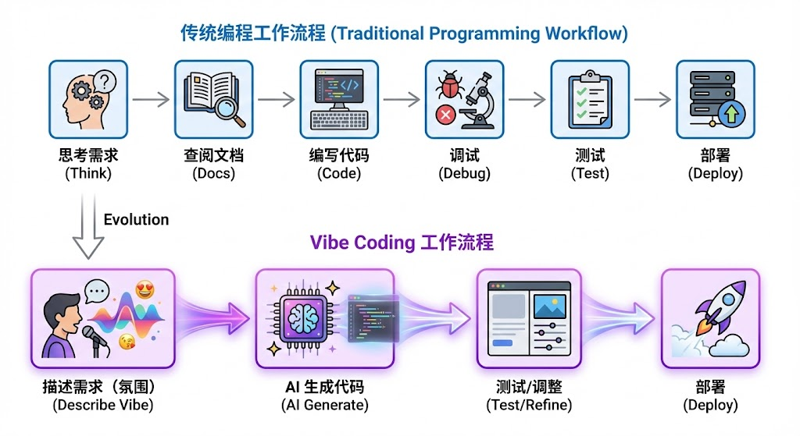

从 Prompt 到上下文工程到 Skills：AI 交互范式的演进与 Vibe Coding 的崛起

## 引言：AI 交互的三次革命

2022 年底，ChatGPT 的横空出世标志着人工智能进入了一个全新的时代。短短两年多时间，我们与 AI 的交互方式已经经历了三次深刻的范式转变：

**第一次革命：Prompt Engineering（提示工程）** —— 我们学会了如何与 AI 对话，用精心设计的提示词来引导模型输出。

**第二次革命：Context Engineering（上下文工程）** —— 我们意识到 AI 的能力不仅取决于提示词本身，更取决于提供给它的上下文环境。RAG、记忆系统、外部知识库的引入，让 AI 从"闭卷考试"变成了"开卷考试"。

**第三次革命：Skills & Agentic AI（技能与智能体）** —— AI 不再只是被动回答问题，而是能够主动调用工具、执行动作、与其他 Agent 协作，成为真正的"数字工作者"。

与此同时，一种全新的编程范式正在悄然兴起 —— **Vibe Coding（氛围编程）**，它正在重新定义人类与 AI 在软件开发中的协作关系。

本文将带你完整走过这段演进历程，无论你是刚接触 AI 的初学者，还是希望深入理解底层逻辑的技术从业者，都能从中获得系统性的认知提升。

---

## 第一章：Prompt Engineering —— 与 AI 对话的艺术

### 1.1 什么是 Prompt Engineering？

Prompt Engineering（提示工程）是指通过设计和优化输入提示（prompt），来引导大型语言模型（LLM）产生更准确、更有用输出的技术。它是最基础、最直观的 AI 交互方式 —— 你输入文字，AI 返回文字。

但Prompt Engineering 远不止是"问问题"这么简单。正如 2025 年的最佳实践所强调的："**Specific prompts are better prompts**"（具体的提示才是好提示）。

**一个糟糕的例子：**
```
"解释气候变化"
```

**一个优秀的例子：**
```
"为高中生撰写一段关于气候变化的三段式总结，使用项目符号，
保持中立语气，控制在 300 字以内。"
```

### 1.2 核心技术技法

#### Zero-Shot Prompting（零样本提示）

直接向模型提出任务，不提供任何示例。这是最简单的方式，适用于模型已经具备相关知识的任务。

```
将以下英文翻译成中文：
"The quick brown fox jumps over the lazy dog."
```

#### Few-Shot Prompting（少样本提示）

提供 3-5 个高质量的示例，让模型学习模式和格式。研究表明，这是提升输出质量最有效的方法之一。

```
将情感分类为正面、负面或中性。

示例 1：
文本："这部电影太棒了！"
情感：正面

示例 2：
文本："服务态度很差"
情感：负面

示例 3：
文本："今天天气晴朗"
情感：中性

待分类文本："这个产品完全不符合预期"
情感：
```

#### Chain-of-Thought (CoT) 思维链

要求模型展示推理过程，而非直接给出答案。这对数学问题、逻辑推理尤其有效。

```
问题：一个农场有 35 只鸡和 28 只兔子。农场主卖掉了一半的鸡和 
三分之一的兔子。还剩多少只动物？

请一步一步思考：
```

模型会输出：
```
1. 初始鸡的数量：35 只
2. 卖掉一半的鸡：35 ÷ 2 = 17.5，取整为 17 只
3. 剩余鸡：35 - 17 = 18 只
4. 初始兔子数量：28 只
5. 卖掉三分之一的兔子：28 ÷ 3 ≈ 9 只
6. 剩余兔子：28 - 9 = 19 只
7. 总共剩余：18 + 19 = 37 只
```

#### ReAct (Reasoning + Acting) 推理+行动

结合推理和工具调用的先进技法。模型不仅思考，还能决定何时使用外部工具。

```
你需要搜索最新信息来回答用户问题。

问题：苹果公司今天的股价是多少？

思考：我需要搜索苹果的最新股价
行动：搜索 "Apple stock price today"
观察：[搜索结果：AAPL $182.50, +1.2%]
思考：我已经获得了股价信息
最终答案：苹果公司今天股价为 182.50 美元，上涨 1.2%
```

### 1.3 2025 年的前沿技术

#### Recursive Self-Improvement Prompting (RSIP) 递归自改进提示

让 AI 批判并改进自己的输出，通过多轮迭代达到更高质量。

**流程：**
1. **生成**：创建初始输出
2. **批判性评估**：让模型使用特定标准识别弱点
3. **改进**：基于批评生成增强版本

实践表明，这种方法可以减少约 60% 的修改周期。

#### Multi-Perspective Simulation (MPS) 多视角模拟

在单次对话中运行"虚拟专家小组"，让模型从不同角度分析问题。

```
请从以下三个角度分析这个商业决策：
1. 财务总监（关注成本与 ROI）
2. 技术总监（关注可行性与技术债务）
3. 市场总监（关注用户体验与竞争优势）

每个视角都需要：
- 阐述核心观点
- 提出潜在风险
- 给出具体建议

最后，请综合三个视角给出整体评估。
```

### 1.4 Prompt Engineering 的局限性

尽管 Prompt Engineering 强大，但它存在根本性限制：

1. **Fragility（脆弱性）**：输入的微小变化、系统版本更新，甚至模型的随机性，都可能导致输出质量波动

2. **Limited Context（上下文限制）**：模型的上下文窗口有限，无法处理大量外部信息

3. **No Real-Time Knowledge（无实时知识）**：模型只能依赖训练数据，无法获取最新信息

4. **No Action Capability（无行动能力）**：模型只能生成文本，无法执行实际操作

这些限制催生了下一个演进阶段 —— Context Engineering。

---

## 第二章：Context Engineering —— 构建 AI 的操作环境

### 2.1 从 Prompt 到 Context 的范式转移

Context Engineering（上下文工程）是 2024-2025 年兴起的新 discipline。如果说 Prompt Engineering 是"写好问题"，Context Engineering 就是"构建完整的操作环境"。

**核心定义：**
> Context Engineering 是系统地设计和管理提供给 LLM 的所有信息 —— 包括提示、检索结果、对话历史、元数据、工具状态 —— 以控制模型的推理和输出，而无需修改模型权重。

简单来说，Context Engineering = Prompt Engineering + RAG + 记忆管理 + 工具状态 + 环境配置

### 2.2 RAG：检索增强生成

RAG（Retrieval-Augmented Generation）是 Context Engineering 的核心组件。它解决了 LLM 无法访问私有数据、无法获取实时信息的问题。

**RAG 工作流程：**

```
用户查询 → 嵌入向量 → 向量数据库检索 → 获取 Top-K 相关文档 
→ 将文档注入提示上下文 → LLM 生成回答
```

**实际应用场景：**

**场景 1：企业知识库问答**
```
基于以下公司内部文档回答问题：
<documents>
[从向量数据库检索的相关文档片段]
</documents>

问题：我们的年假政策是什么？
请引用相关文档的具体章节并标注页码。
```

**场景 2：客服机器人**
```
你是一个客服助手。以下是相关的产品文档和历史对话：
<context>
[产品手册片段]
[用户之前的工单记录]
[常见问题解答]
</context>

用户问题：我的订单什么时候能到？
订单号：#12345
```

### 2.3 上下文工程的技术支柱

#### 1. Prompt Design（提示设计）

动态提示模板，根据用户、任务和系统状态组装不同的提示。

```python
# 动态提示模板示例
def build_prompt(user_type, task, context):
    system_prompt = f"你是一个{user_type}专家助手。"
    user_prompt = f"任务：{task}\n\n上下文：{context}"
    return system_prompt + user_prompt
```

#### 2. Context Composition（上下文组合）

现代 AI 系统需要组合多层上下文：

- **对话历史**：保持对话连贯性
- **检索结果**：外部知识注入
- **当前工具状态**：告诉 AI 有哪些工具可用
- **Agent 目标与计划**：长期任务的状态跟踪
- **用户画像/偏好**：个性化设置

```python
context_stack = {
    "system_instructions": "你是一个研究助手...",
    "user_profile": {"role": "研究员", "expertise": "AI"},
    "conversation_history": [...],
    "retrieved_documents": [...],
    "available_tools": ["search", "calculator", "code_runner"],
    "current_task_state": {"step": 3, "goal": "完成报告"}
}
```

#### 3. Memory Systems（记忆系统）

生产级 Agent 需要四层记忆架构：

| 记忆类型 | 描述 | 技术实现 |
|---------|------|---------|
| **Short-Term Memory (STM)** | 当前对话的短期上下文 | 滑动窗口，保留最近 N 轮对话 |
| **Working Memory** | 当前任务的临时状态 | 变量存储，任务完成即清除 |
| **Long-Term Memory (LTM)** | 用户偏好、历史交互 | 向量数据库持久化存储 |
| **Episodic Memory** | 特定事件/经验的记忆 | 结构化存储，支持语义检索 |

### 2.4 Prompt Engineering vs Context Engineering

| 维度 | Prompt Engineering | Context Engineering |
|------|-------------------|---------------------|
| **关注点** | 提示词的措辞和结构 | 完整的输入环境设计 |
| **范围** | 单次交互 | 多轮对话 + 外部系统 |
| **技术栈** | 自然语言 + 模板 | RAG + 向量DB + 记忆系统 |
| **目标** | 优化单次输出 | 塑造持续可靠的行为 |
| **适用场景** | 简单问答、内容生成 | 复杂应用、生产系统 |

**关键洞察：**
> "Prompt Engineering 优化即时输出，Context Engineering 治理模型在推理前看到的所有上下文，塑造生产系统中的持续行为。"

---

## 第三章：Skills、Tool Use 与 Agentic AI —— 从说话到行动

### 3.1 工具调用：AI 的"手"和"脚"

如果说 Context Engineering 给了 AI "眼睛"（看外部信息），那么 Tool Use（工具调用）就给了 AI "手"和"脚"（执行动作）。

**Tool Calling 的定义：**
> 工具调用是 LLM 决定使用外部功能（运行代码、调用 API、搜索网页、操作数据库）来完成模型自身无法独立完成的任务的过程。

**工具调用的决策流程：**

```
1. 解析用户查询 → 理解用户想要什么
2. 映射意图到工具模式 → 对比可用工具描述
3. 决定是否需要工具 → 纯推理 vs 需要执行
4. 生成结构化工具调用 → JSON 格式的函数调用
5. 在外部执行工具 → Python/API/数据库查询
6. 将输出返回给 LLM → 工具执行结果
7. LLM 决定下一步 → 继续调用工具或直接回答
```

### 3.2 Function Calling 实战示例

**示例：天气查询 Agent**

首先，定义工具的模式（Schema）：

```json
{
  "name": "get_weather",
  "description": "获取指定城市的当前天气",
  "parameters": {
    "type": "object",
    "properties": {
      "city": {
        "type": "string",
        "description": "城市名称，如 '北京'、'上海'"
      },
      "unit": {
        "type": "string",
        "enum": ["celsius", "fahrenheit"],
        "description": "温度单位"
      }
    },
    "required": ["city"]
  }
}
```

用户输入："北京今天天气怎么样？"

LLM 的决策过程：
```
思考：用户询问北京天气，我需要调用 get_weather 工具
工具调用：{"tool": "get_weather", "arguments": {"city": "北京", "unit": "celsius"}}
```

后端执行工具，返回：
```json
{
  "temperature": 22,
  "condition": "晴朗",
  "humidity": "45%"
}
```

LLM 生成最终回答：
```
北京今天天气晴朗，气温 22°C，湿度 45%，是个出行的好天气！
```

### 3.3 MCP：模型上下文协议 —— AI 的"USB-C"

2024 年底，Anthropic 推出了 **MCP（Model Context Protocol）**，这是一个开放标准协议，旨在标准化 AI 系统与外部工具和数据源的交互方式。

**MCP 的核心愿景：**
> "就像 USB-C 为各种设备提供通用连接一样，MCP 为 AI 模型提供统一的接口来连接不同的工具和数据源。"

**MCP 架构：**


**MCP 2025 年路线图包括：**

1. **远程 MCP 连接**：支持 OAuth 2.0 认证与授权
2. **分发与发现**：包管理、安装工具、服务器注册
3. **Agent 支持**：分层 Agent 系统、交互式工作流、流式结果

MCP 正在快速成为行业标准，类似于当年的 LSP（Language Server Protocol）。

### 3.4 A2A：Agent-to-Agent 协议 —— AI 的"社交语言"

如果说 MCP 是 AI 与工具的通用接口，那么 **A2A（Agent-to-Agent Protocol）** 就是 AI 与 AI 之间的通用语言。

2025 年 4 月，Google 推出了 A2A 协议，这是一个开放标准，旨在让不同框架、不同厂商的 AI Agent 能够发现彼此、协商任务、协作完成复杂工作流。

**A2A 的五大设计原则：**

1. **拥抱自然 Agent 能力**：不强制改变 Agent 的工作方式
2. **基于现有标准**：使用 HTTP、JSON-RPC 等成熟技术
3. **企业级安全**：内置认证、授权、加密
4. **支持长时间任务**：异步执行、状态更新、推送通知
5. **模态无关**：支持文本、音频、视频、结构化数据

**A2A 的核心概念：**

| 组件 | 描述 |
|------|------|
| **Agent Cards** | JSON 元数据文件，描述 Agent 的能力、身份、端点 |
| **Task Management** | 任务生命周期管理：发起、状态更新、完成通知 |
| **Collaboration** | Agent 间交换上下文、协商执行方式 |
| **UX Negotiation** | 协商内容类型和格式，适应不同 UI 能力 |

**实际应用场景：**

**招聘流程自动化：**

```
招聘经理 Agent → 发布招聘需求
       ↓
猎头 Agent A → 搜索候选人
       ↓
猎头 Agent B → 安排面试
       ↓
背景调查 Agent → 执行背景核查
       ↓
所有结果汇总 → 招聘经理 Agent
```

每个 Agent 可能来自不同厂商、使用不同框架，但通过 A2A 协议可以无缝协作。

### 3.5 现代 Agent 架构

一个生产级的 AI Agent 可以形式化定义为：

```
Agent := <Perception, Memory, Reasoning, Planning, Action, Feedback>
```

**各组件详解：**

| 组件 | 功能 | 技术实现 |
|------|------|---------|
| **Perception** | 接收输入 | 文本解析、API 适配器、日志读取 |
| **Memory** | 存储状态 | 向量 DB、文档存储、短期上下文 |
| **Reasoning** | 推理决策 | LLM 推理 + CoT/ReAct/ToT |
| **Planning** | 任务规划 | 任务分解、工具选择、执行图 |
| **Action** | 执行动作 | 工具调用、API 请求、代码执行 |
| **Feedback** | 反馈学习 | 错误分析、自我批评、记忆更新 |

**2025 年的 Agent 类型：**

1. **Deep Research Agents**：自主进行深度研究，如 Perplexity、Grok
2. **Coding Agents**：Devin、Cursor IDE Agents，自主编写、调试、测试代码
3. **CUA (Computer-Using Agents)**：模拟人类操作电脑界面，如 AutoGPT、SIMA
4. **Multi-Agent Systems**：多个专业 Agent 协作，如 CrewAI、AutoGen

---

## 第四章：Vibe Coding —— 编程范式的颠覆

### 4.1 什么是 Vibe Coding？

**Vibe Coding** 是 2024-2025 年兴起的一种全新编程范式。它不关注代码的具体语法，而是关注"氛围"——开发者用自然语言描述想要的功能和感觉，AI 负责生成具体的代码实现。

**核心定义：**
> Vibe Coding 是一种开发方法，开发者使用自然语言提示 AI 工具生成软件代码。它将重点从手动编码转移到 AI 引导的构建方式。

**Vibe Coding 的工作流程：**



### 4.2 Vibe Coding 的起源与演进

**2023 年**：Reddit 上的开发者开玩笑说他们在用 ChatGPT "vibe" 功能到现实中 —— 这只是一个梗。

**2024 年底**：OpenAI 创始成员 Andrej Karpathy 认真对待这个概念，称之为"AI 原生开发的下一个演进"。

**2025 年初**：《华尔街日报》确认企业开始在实际开发工作流中采用 Vibe Coding。

**今天**：Vibe Coding 已经从梗变成了严肃的方法论。

### 4.3 Vibe Coding 的工具生态

| 工具 | 特点 | 适用场景 |
|------|------|---------|
| **Cursor** | AI 原生代码编辑器，对话式开发 | 专业开发，复杂项目 |
| **GitHub Copilot X** | IDE 内实时代码建议 | 日常编码，快速补全 |
| **Replit Ghostwriter** | 浏览器内多模态构建 | 快速原型，教育 |
| **Claude 3/4** | 长上下文理解 | 复杂逻辑，代码审查 |
| **ChatGPT-4/4.5** | 自然语言优先 | 快速原型，学习 |

### 4.4 Vibe Coding 实战示例

**场景：创建一个待办事项应用**

**传统方式：**
```javascript
// 需要手动编写所有代码
import React, { useState } from 'react';

function TodoApp() {
  const [todos, setTodos] = useState([]);
  const [input, setInput] = useState('');
  
  const addTodo = () => {
    if (input.trim()) {
      setTodos([...todos, { id: Date.now(), text: input, done: false }]);
      setInput('');
    }
  };
  
  // ... 还需要写 toggle、delete、filter 等功能
  
  return (
    // ... JSX 代码
  );
}
```

**Vibe Coding 方式：**

```
用户："创建一个漂亮的待办事项应用，要有：
- 添加任务的功能
- 标记完成/未完成
- 删除任务
- 按状态筛选（全部/进行中/已完成）
- 使用现代简洁的设计风格
- 数据保存在 localStorage"

AI：（生成完整可运行的代码）

用户："把完成任务的动画做得更流畅一些，
再加一个进度统计在顶部"

AI：（更新代码）
```

### 4.5 Vibe Coding 的核心理念

1. **设计优先，快速原型**：先描述想要的感觉和体验，再迭代细节
2. **对话式调试**：用自然语言问"为什么这个会失败？"而不是查文档一小时
3. **关注产品而非语法**：把精力集中在用户体验和业务逻辑上
4. **迭代速度至上**：快速实验，快速验证，快速调整

### 4.6 Vibe Coding 的优势与风险

**优势：**
- ✅ 极大提升开发速度（10倍加速在 build-test 周期）
- ✅ 降低编程门槛，非技术人员也能构建原型
- ✅ 减少样板代码的编写
- ✅ 加速学习和实验

**风险与争议：**
- ⚠️ **安全漏洞**：AI 生成的代码可能存在安全隐患，需要人工审查
- ⚠️ **技术债务**：快速生成的代码可能缺乏长期可维护性
- ⚠️ **理解深度**：开发者可能不完全理解 AI 生成的代码
- ⚠️ **调试困难**：当 AI 生成的代码出错时，定位问题可能更困难

**最佳实践：**
> "Vibe Coding 不是完全替代传统开发，而是改变开发者的角色 —— 从逐行编写代码，转变为指导、测试和优化 AI 生成的输出。开发者成为 AI 的导师，确保生成的代码符合项目需求和最佳实践。"

---

## 第五章：整合与展望 —— 四层架构的统一视图

### 5.1 四个层次的演进关系

```
┌─────────────────────────────────────────────────────────────────┐
│                    第四层：Vibe Coding                           │
│              （人类与 AI 协作的最高形态）                          │
│         开发者描述意图 → AI 生成完整应用 → 迭代优化               │
├─────────────────────────────────────────────────────────────────┤
│                    第三层：Skills & Agentic AI                   │
│              （AI 的行动能力和协作能力）                           │
│    MCP（工具连接） + A2A（Agent 协作） + Function Calling        │
├─────────────────────────────────────────────────────────────────┤
│                    第二层：Context Engineering                   │
│              （AI 的知识环境和记忆系统）                           │
│         RAG + 记忆管理 + 上下文组合 + 外部数据注入                │
├─────────────────────────────────────────────────────────────────┤
│                    第一层：Prompt Engineering                    │
│              （与 AI 对话的基础能力）                              │
│         Zero/Few-Shot + CoT + ReAct + 结构化输出                │
└─────────────────────────────────────────────────────────────────┘
```

### 5.2 各层之间的依赖关系

- **Prompt Engineering 是基础**：所有上层都依赖于如何有效地与模型沟通
- **Context Engineering 是增强**：让模型能够访问更多信息和知识
- **Skills/Agentic AI 是跃迁**：让模型从"说话"到"行动"
- **Vibe Coding 是融合**：重新定义人类在 AI 时代的角色

### 5.3 2025-2026 年的关键趋势

#### 趋势 1：协议标准化

MCP 和 A2A 正在快速成为行业标准，类似于：
- **MCP ≈ USB-C**：统一 AI 与工具的连接方式
- **A2A ≈ HTTP**：统一 AI 与 AI 的通信方式

#### 趋势 2：Agent 经济崛起

据 2025 年全球 AI 调查：
- 29% 的企业已经在生产环境运行 Agentic AI
- 44% 计划在未来一年内加入
- 88% 的早期采用者报告了正向 ROI

#### 趋势 3：开发者角色转型

开发者的工作正在从：
```
编写代码 → 架构设计 + AI 协作 + 代码审查
```

#### 趋势 4：多 Agent 协作成为常态

复杂任务将由多个专业 Agent 协作完成：
- 研究 Agent + 写作 Agent + 审查 Agent
- 前端 Agent + 后端 Agent + 测试 Agent
- 数据分析 Agent + 可视化 Agent + 报告 Agent

### 5.4 给初学者的学习路径

**阶段 1：掌握 Prompt Engineering（1-2 周）**
- 学习 Zero/Few-Shot、CoT、ReAct 等基础技术
- 练习编写清晰、具体的提示
- 理解模型的能力和局限性

**阶段 2：理解 Context Engineering（2-3 周）**
- 学习 RAG 原理和实现
- 了解向量数据库（Pinecone、Weaviate、Chroma）
- 实践构建有记忆的对话系统

**阶段 3：探索 Tool Use & Agents（3-4 周）**
- 学习 Function Calling
- 了解 MCP 协议
- 尝试构建简单的 Agent

**阶段 4：实践 Vibe Coding（持续）**
- 使用 Cursor、Copilot 等工具
- 从小项目开始，逐步建立信任
- 保持批判性思维，审查 AI 生成的代码

### 5.5 给技术从业者的深度建议

1. **深入理解协议层**：MCP 和 A2A 将成为基础设施，理解它们的设计哲学
2. **关注 Agent 架构**：学习 ReAct、ToT、Reflexion 等推理模式
3. **掌握编排能力**：多 Agent 系统的协调、状态管理、错误恢复
4. **保持工程纪律**：AI 再强大，软件工程的基本原则依然适用

---

## 结语：人机协作的新纪元

从 Prompt Engineering 到 Context Engineering，从 Tool Use 到 Vibe Coding，我们正见证着人机协作方式的根本性转变。

这不仅仅是技术的演进，更是**认知范式的转移**：

- **过去**：人类告诉计算机"如何做"（How）
- **现在**：人类告诉 AI"做什么"（What）
- **未来**：人类与 AI 共同探索"为什么做"（Why）

在这个新时代，最宝贵的技能不再是记住最多的 API 或写出最优雅的算法，而是：

1. **清晰表达意图的能力** —— 知道你想要什么
2. **批判性评估的能力** —— 判断 AI 输出是否正确
3. **系统思考的能力** —— 理解各部分如何协同工作
4. **持续学习的能力** —— 适应快速变化的技术 landscape

正如 Vibe Coding 所揭示的，未来的开发者可能不再是"代码的编写者"，而是"智能的编排者"。而 Prompt Engineering、Context Engineering、Skills 这些层次，正是构建这个新世界的基石。

无论你是初学者还是资深工程师，现在都是最好的入场时机。因为在这个领域，每个人都在学习，每天都有新发现，每个参与者都有机会塑造未来。

---

## 参考资源

**Prompt Engineering：**
- [Prompt Engineering Best Practices 2025](https://codesignal.com/blog/prompt-engineering-best-practices-2025/)
- [The Complete Prompt Engineering Guide for 2025](https://aloaguilar20.medium.com/the-complete-prompt-engineering-guide-for-2025-mastering-cutting-edge-techniques-dfe0591b1d31)

**Context Engineering：**
- [What is Context Engineering?](https://medium.com/towards-generative-ai/what-is-context-engineering-and-why-is-everyone-talking-about-it-9138b8556af4)
- [Context Engineering: Best Practices & Examples](https://www.mezmo.com/learn-observability/context-engineering-for-observability-how-to-deliver-the-right-data-to-llms)

**Agentic AI & Protocols：**
- [Model Context Protocol](https://www.anthropic.com/news/model-context-protocol) - Anthropic
- [Agent2Agent Protocol](https://developers.google.com/agent-to-agent) - Google
- [The Rise of Autonomous AI Agents](https://medium.com/@harshalsant0/the-rise-of-autonomous-ai-agents-architecture-internal-mechanics-production-engineering-2025-afcbcce91192)

**Vibe Coding：**
- [Vibe Coding in 2025](https://skywinds.tech/vibe-coding-custom-software-2025/)
- [What is Vibe Coding?](https://www.tanium.com/blog/what-is-vibe-coding/)
- [Vibe Coding: Fun, AI-Assisted Programming](https://www.sashido.io/en/blog/vibe-coding-fun-ai-assisted-programming)
