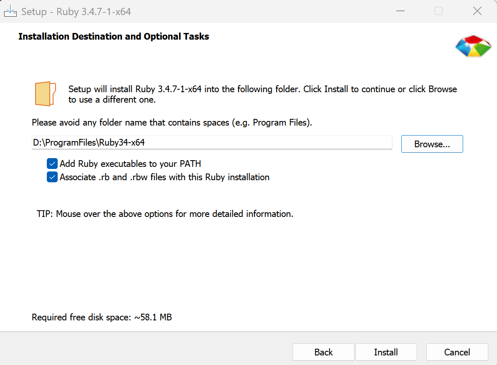
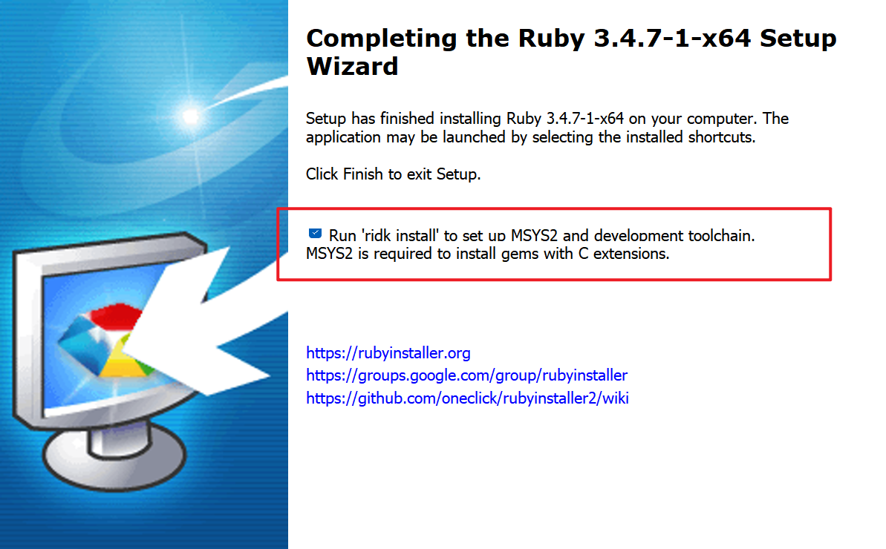

# 在Windows上轻松安装Jekyll：打造你的个人博客

之前分享了如何在GitHub上搭建个人博客，但缺少Jekyll的安装教程。最近换了新电脑，正好借此机会补上这个重要的环节，为想要搭建技术博客的朋友们提供一份详细的Windows安装指南。

## 第一步：安装Ruby环境

Jekyll基于Ruby开发，所以我们首先需要安装Ruby环境：

1. 访问[Ruby官网](https://rubyinstaller.org/downloads/)下载适合你的RubyInstaller
2. 我选择的是[rubyinstaller-devkit-3.4.7-1-x64](https://github.com/oneclick/rubyinstaller2/releases/download/RubyInstaller-3.4.7-1/rubyinstaller-devkit-3.4.7-1-x64.exe)版本
3. 你也可以根据系统配置选择合适的版本


安装时的关键步骤：

- 双击下载的安装程序，按提示进行安装
- **重要**：务必勾选"添加到PATH"选项，方便在命令行中直接使用
- 安装过程中会自动安装MSYS2，这是后续安装gem和Jekyll的必要组件



安装完成后，打开命令提示符测试是否安装成功：

```shell
ruby -v
```



## 第二步：安装RubyGems

RubyGems是Ruby的包管理器，我们需要用它来安装Jekyll：

1. 前往[RubyGems下载页面](https://rubygems.org/pages/download)
2. 选择ZIP格式下载


安装步骤：

- 将下载的ZIP文件解压到合适的目录
- 在解压后的文件夹中打开命令提示符
- 运行安装命令：

```shell
ruby setup.rb
```


## 第三步：安装Jekyll及相关组件

现在我们可以开始安装Jekyll了：

安装Jekyll核心：
```shell
gem install jekyll
```

安装分页插件（很多主题都需要）：
```shell
gem install jekyll-paginate
```

验证安装是否成功：
```shell
jekyll -v
```

## 第四步：本地测试

在你的Jekyll博客目录中，启动本地服务器：

```shell
bundle exec jekyll server
```

如果提示缺少某些插件，按照提示安装即可：


安装完成后重新运行，看到成功提示：


在浏览器中访问 `http://localhost:4000`，就能看到你的博客在本地运行的效果了！


## 安装完成！🎉

恭喜！现在你已经在Windows上成功安装了Jekyll，可以开始本地开发和测试你的博客了。如果在安装过程中遇到任何问题，欢迎在评论区留言交流。

**贴心提示**：建议将整个安装过程记录下来，这样下次换电脑或者重装系统时就能快速完成环境配置。


*参考资源：[在Windows上安装Jekyll](https://www.jianshu.com/p/58e2c5ea3103)*


**博客作者简介**
大家好，我是一名热爱分享的技术博主，专注于Web开发和开源技术。通过这个博客，我希望与大家分享我的学习心得和实践经验，帮助更多开发者解决实际问题。如果你对技术分享感兴趣，欢迎关注我的博客，我们一起成长！