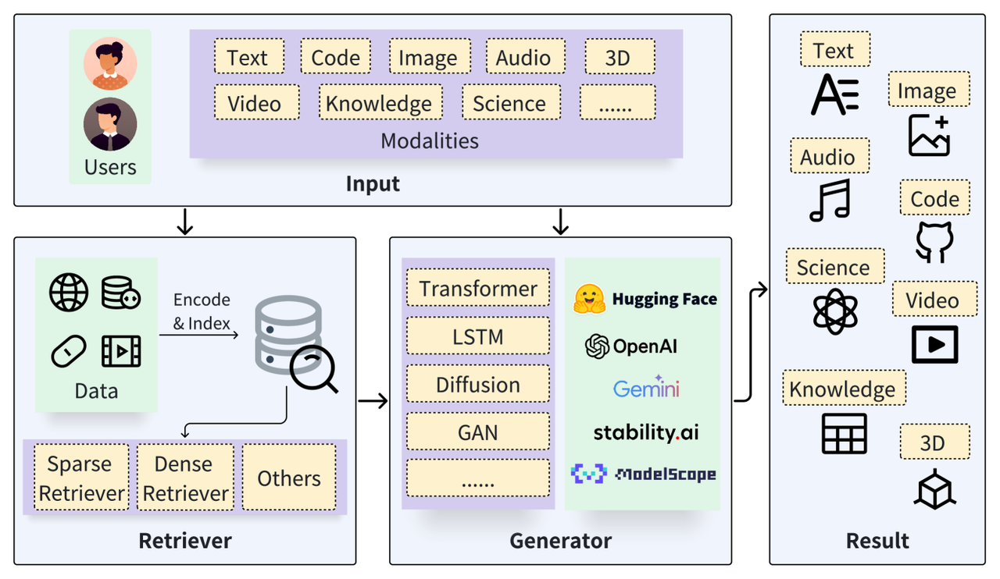
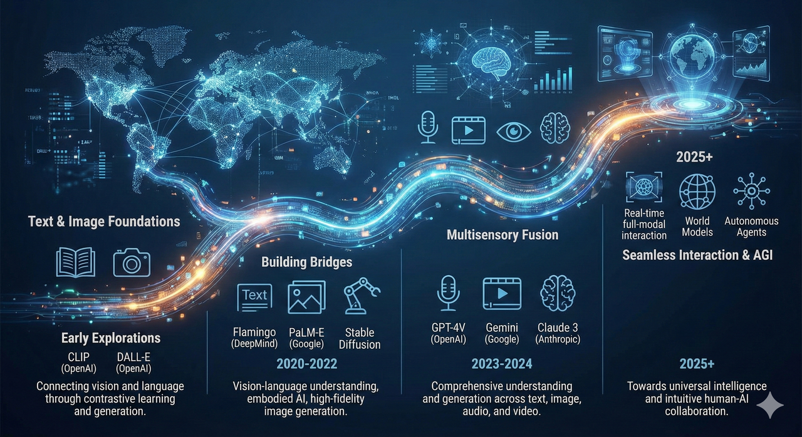
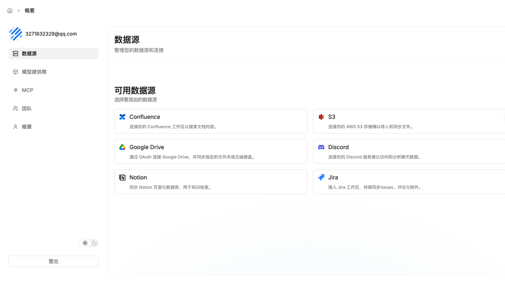

RAG（Retrieval Augmented Generation）：检索增强生成

## 0 引言

写在前面，作者也是初学者，抱着学习的心态写了这篇文章，如果有问题，欢迎大家[邮箱](mailto:morange0205@gmail.com)联系进行批评指正。

本篇将系统介绍RAG的基本概念、核心技术原理、发展背景和典型架构，随后深入探讨多模态RAG（如文本-图像、文本-视频的检索增强生成）和Graph RAG（基于图结构数据的检索增强生成）等前沿方向，最后分析当前面临的挑战与未来发展趋势。

## 1 基本概念

RAG（Retrieval Augmented Generation），中文名称是检索增强生成，通俗意义上来讲就是通过检索提升大模型生成效果的技术，旨在提升生成式AI的准确性与可信度。它实现了大语言模型与外部知识库的结合，是缓解幻觉与提升可追溯性的关键路线之一。该概念最初由Facebook AI研究团队在2020年提出，并发表了命名RAG的开创性论文。如今，RAG已发展为一类庞大的方法体系，被认为是通向更可靠生成式AI的重要方向。

## 2 背景和技术原理

### 2. 1 背景

大模型在没有外部知识库的情况下也能"记住"大量知识，但仍然存在明显局限：参数中的知识更新成本高、回答往往缺少可核验的证据来源；遇到冷门知识、最新信息或长链路推理时，错误率会上升；在多轮对话与长上下文场景里，也可能出现信息遗忘、主题漂移与证据混淆等问题。

比如，你问的是aorangehc是谁，它却开始讲爱因斯坦是谁，这类与问题无关或事实不符的生成通常被称为幻觉（LLM Hallucination)。幻觉并非某一个模型的偶然故障，而是概率式生成在信息不足、目标不清或证据缺失时容易出现的系统性现象，因此研究者开始从模型之外引入约束与外部信息来降低这类问题的发生。

一种方法是在预训练之后对模型进行指令微调与对齐训练，让它在不确定时更倾向于回答"不知道"或主动澄清。一种方法是使用者通过Prompt对回答范围、证据要求与输出格式进行限制，减少模型自由发挥的空间。

还有一种就是引入外部知识库。我们现在使用ChatGPT、Gemini、Kimi、豆包以及DeepSeek等大模型应用时，经常会看到联网搜索或知识库问答功能：系统会根据问题去外部数据源检索网页或文档片段，将检索结果作为证据提供给模型，再由模型基于证据与自身语言能力组织答案，从而显著提升事实性与可解释性。这个"先检索、再生成"的过程，就是RAG的典型范式。

### 2.2 技术原理

现在意义上的大模型具有很多能力，我们日常中更多是使用大模型进行提问，让它解决遇到的难题，比如Python代码报错，把报错信息扔给大模型，它给出修改意见，这个过程中使用的主要能力是指令遵循。除此之外还有上下文学习、推理、工具使用等，随着技术的发展，大模型可调用的能力在不断扩展。

在RAG中主要利用的就是大模型的上下文学习能力，通过检索获取相关知识作为上下文提供给大模型，然后由大模型基于问题与证据进行归纳总结并生成回答。

RAG的核心思想是在生成任务中引入检索模块。模型在接到输入后，先由检索模块从外部知识库（如维基百科、专有文档库、企业内部资料等）中检索出相关资料，再将检索到的内容与原始输入一起送入生成模型，生成最终回答或文本。这种"检索-生成"策略使模型能够现查现用所需知识，而不必完全依赖参数中存储的旧知识。OpenAI的WebGPT工作即是典型案例：它让GPT-3在一个受控的浏览环境中搜索网页、抽取引用片段并据此回答长问题，从而提升答案的事实性与可核验性。通过引入检索，不仅能降低幻觉发生率，也使知识库可以更灵活地扩展与更新，例如用户可以按需接入新的数据源供系统使用。

自RAG提出后，各大研究团队纷纷推出改进的检索增强模型。例如，DeepMind在2021年发布的RETRO模型通过接入超大规模文本数据库进行检索增强，在较小参数规模下取得了与当时超大模型相当甚至在部分基准上更优的效果，体现了检索对"以更小模型获得更强知识能力"的潜力。又如Meta在2022年推出的Atlas模型，将预训练的检索增强语言模型用于少样本学习，在开放域问答等知识密集任务上，用显著更少的参数规模取得了与超大模型相竞争的表现。这些成果表明，检索增强可以在更小模型规模下达到甚至逼近超大模型的效果，凸显了参数与检索融合的效率优势与工程价值。

## 3 RAG框架

图片引用自文献[Retrieval-Augmented Generation for  AI-Generated Content: A Survey](https://arxiv.org/abs/2402.19473)

典型RAG系统包含检索器与生成器两大核心组件。

### 3.1 RAG基本流程

首先，输入查询会被检索模块编码为向量表示，并在外部知识库的向量索引中进行相似度搜索，检索出若干相关文本片段，并可能应用重排序技术来提高精度。随后，这些检索到的证据片段与原始查询一并提供给生成模型，模型将基于问题与证据生成最终回答。通过将外部知识融入生成过程，RAG能够让回答更贴近事实，并在工程实现上支持给出引用来源与证据片段，从而提升可解释性与可审计性。

经典RAG在生成整个回答时往往使用固定的一组检索文档；也有更高级的变体如RAG-Token，可以在生成过程中对不同位置动态使用不同检索证据，从而提升信息使用的灵活性。

无论哪种方式，检索结果与生成模型的融合都是关键。很多实现会将检索文本直接拼接到模型输入中，而一些研究也探索在模型内部以更结构化的方式利用检索信息，使模型在生成时能更稳定地对齐证据、减少无关发挥。实践中，检索器与生成器既可以分阶段独立优化，也可以在特定设定下进行联合训练或端到端微调，以让检索器更偏向于返回对生成最有帮助的证据、生成器也更善于引用与整合证据。

### 3.2 检索器

检索是指根据信息需求识别并获取相关信息。具体来说，我们可以将信息资源视为一个键值存储，其中每个键对应一个值，键和值可以相同。给定一个查询，目标是使用相似性函数搜索出最相似的前k个键，并获取与之配对的值。根据不同的相似性函数，现有的检索方法可分为稀疏检索、稠密检索及其他类型。

#### 3.2.1 稀疏检索器

稀疏检索器利用词项匹配指标，如TF-IDF、BM25，主要用于文档的相关检索。这些方法通过分析文本中的词统计信息并构建倒排索引来实现高效搜索。本质上，BM25是大规模网络搜索中的一个强大基线，它整合了逆文档频率权重、查询词项出现次数和其他相关指标。

#### 3.2.2 稠密检索器

稠密检索通过稠密嵌入向量来表示查询和键，并构建近似最近邻索引加快搜索速度，能用于所有模态的检索。稠密检索将原本的数据通过预训练模型编码成为向量，然后通过计算相似度分数进行检索，相似度计算可以通过余弦、内积和L2距离等。

现在的RAG系统为了提升效果一般采用稀疏检索+稠密检索的混合检索模式，提升效果。

### 3.3 生成器

生成器结合检索到的内容，生成所需内容。

随着AIGC时代的发展，生成器也不断发展丰富成熟，不同的生成器模型可以用于不同的场景，比如

* Transformer模型用于文本到文本的任务

* VisualGPT可以用于图像到文本的任务

* Stable Diffusion可以用于文本到图像的任务

* Codex可以用于文本到代码的任务

## 4 RAG增强

是的检索增强生成(的)增强也是很重要的研究点，有很多技巧。

### 4.1 输入增强

最初输入到检索器中的内容对检索阶段的最终结果有显著影响，输入增强的方式主要有以下几种。

#### 4.1.1 查询转换

查询转换可以通过修改输入查询来增强检索结果。

Query2doc和HyDE，利用原始查询生成伪文档，之后将该伪文档用作检索的查询。伪文档包含更丰富的相关信息，有助于检索出更准确的结果。

TOC利用检索到的内容，将模糊的查询分解为多个清晰的子查询，这些子查询被发送到生成器，经聚合后产生最终结果。对于。

RQ-RAG将复杂或模糊的查询分解为清晰的子查询以进行细粒度检索，并对响应进行综合，从而为原始查询提供连贯的答案

#### 4.1.2 数据增强

数据增强表示在检索前对数据进行改进，包括去除无关信息、消除歧义、更新过时文档、合成新数据等技术

Make-An-Audio利用字幕生成和音频-文本检索为无语言音频生成字幕，以缓解数据稀疏问题，并添加随机概念音频来改进原始音频。

LESS通过分析梯度信息优化下游任务的数据集选择，旨在提升模型对指令提示的响应性能。

ReACC通过重命名和死代码插入来预训练代码检索模型。

### 4.2 检索器增强

#### 4.2.1 递归检索

归检索是指执行多次搜索以获取更丰富、更高质量的内容。

ReACT利用思维链（CoT）将查询分解以进行递归检索，并提供更丰富的信息。

RATP采用蒙特卡洛树搜索进行模拟，以选择最优的检索内容，然后将其模板化并转发给生成器进行输出。

#### 4.2.2 块优化

块优化指的是调整块大小以改善检索结果。

LlamaIndex集成了一系列 chunk 优化方法，其中一种遵循"从小到大"的原则。其核心思想是精准定位更细粒度的内容，同时返回更丰富的信息。例如，句子窗口检索会获取小的文本块，并返回检索片段周围的相关句子窗口。在自动合并检索中，文档被组织成树状结构。该过程先获取子节点，再检索包含其子节点内容的父节点。

RAPTOR采用递归嵌入、聚类和文本块摘要的方法，直到无法进一步聚类为止，从而构建多层树状结构。

Prompt-RAG通过预先生成目录来提高检索准确性，使模型能够根据查询自主选择相关章节。

#### 4.2.3 检索器微调

在稠密检索中检索器依赖于一个高效的嵌入模型，来表示相关内容并为生成器提供输入，从而提升系统性能。

可以通过特定领域或任务相关的数据进行微调，以提升在目标领域的性能。

REPLUG将语言模型视为黑盒，并根据最终结果更新检索模型。

APICoder使用Python文件以及API名称、签名和描述对检索模型进行微调。

EDITSUM对检索模型进行微调，以减小检索后摘要之间的杰卡德距离。

最新的模型Qwen3系列开源了多种embedding和rerank模型，并开放了技术报告，效果很好。其中小模型适合用来做微调测试和效果对比。

#### 4.2.4 混合检索

混合检索指同时采用多种不同的检索方法或从多个不同的来源提取信息。

RAP-Gen、BlendedRAG 和ReACC均同时使用密集检索器和稀疏检索器来提高检索质量。

Rencos使用稀疏检索器在句法层面检索相似的代码片段，并使用密集检索器在语义层面检索相似的代码片段。

BASHEXPLAINER首先使用密集检索器捕获语义信息，然后使用稀疏检索器获取词汇信息。

RetDream先通过文本进行检索，再通过图像嵌入进行检索。

CRAG的特点是配备了一个检索评估器，用于衡量文档与查询的相关性，并根据置信度生成三种检索响应：如果结果准确，则直接用于知识优化；如果结果不正确，则进行网络搜索；对于模糊情况，则采用混合方法。

#### 4.2.5 Rerank

重排序应该是最常见的方式，指对检索到的内容进行重新排序，以获得更高的多样性和更好的结果。也有很多重排序的模型开源可以使用。

Re2G在传统检索器之后应用了一个重排序器模型，以减少因将文本压缩为向量而导致的信息丢失所带来的影响。

AceCoder利用选择器对检索到的程序进行重排序，以减少冗余程序并获得多样化的检索程序。

XRICL在检索后使用基于蒸馏的示例重排序器。

Rangan采用量化影响度量，通过评估查询和参考之间的统计偏差来衡量数据子集的相似性，并对检索结果进行重排序。

UDAPDR利用大语言模型经济高效地生成用于训练特定领域重排序器的合成查询，然后应用多教师知识蒸馏来开发一个协同的检索器。

#### 4.2.6 检索转换

检索转换通过重新表述检索到的内容，以更好地激发生成器的潜力，从而改进输出结果。

FILCO能高效地从检索到的文本中清除无关内容，只保留相关的支持性内容，从而简化生成器的任务，有助于准确预测答案。

FiD-Light首先使用编码器将检索到的内容转换为向量，然后对其进行压缩，大幅减少了延迟时间。

### 4.3 生成器增强

#### 4.3.1 提示工程-Prompt Engineering

提示工程是一种专注于提高大型语言模型输出质量的提示工程技术，如提示压缩、后退提示、主动提示、思维链提示等，均适用于检索增强生成系统中的大型语言模型生成器。

LLMLingua应用一个小型模型来压缩查询的整体长度，以加速模型推理，减轻无关信息对模型的负面影响，并缓解中间迷失现象。

ReMoDiffuse通过使用ChatGPT将复杂描述分解为结构化文本脚本。

ASAP将包含输入代码、函数定义、分析结果和相应注释的示例元组纳入提示词中，以获得更好的结果。

CEDAR使用设计好的提示词模板，将代码演示、查询和自然语言指令组织成提示词。

XRICL利用思维链技术，在跨语言语义解析和推理中添加翻译对作为中间步骤。

ACTIVERAG采用认知连接机制来校准大语言模型的内在认知，并在答案生成中应用思维链提示词。

Make-An-Audio能够使用其他模态作为输入，这可以为后续过程提供更丰富的信息。

#### 4.3.2 解码调优

解码调优包括通过微调超参数来增强生成器控制，以提高多样性、限制输出词汇量以及进行其他调整。

InferFix通过调整解码器的温度来平衡结果的多样性和质量。（温度可以理解为一个参数，控制模型生成内容的发散程度）

SYNCHROMESH通过实施补全引擎来消除实现错误，从而限制解码器的输出词汇量。

#### 4.3.3 生成器微调

生成器的微调可以增强模型掌握更精确领域知识的能力，或使其更好地与检索器相适配。

RETRO固定了检索器的参数，并在生成器中使用分块交叉注意力机制来结合查询和检索器的内容。

CARE 利用图像、音频和视频-文本对训练编码器，然后微调解码器（生成器）以同时减少字幕和概念检测损失，同时保持编码器和检索器固定。

Animate-A-Story利用图像数据优化视频生成器，然后微调LoRA适配器以捕捉给定角色的外观细节。

### 4.4 结果增强

#### 4.4.1 输出重写

输出重写指的是在特定场景下对生成器生成的内容进行改写，以满足下游任务的需求。

SARGAM通过采用一种特殊的Transformer，结合删除分类器、占位符分类器和插入分类器，在代码相关任务中优化输出，使其更贴合现实世界的代码语境。

Ring根据生成器产生的每个令牌的对数概率平均值对候选结果进行重新排序，从而获得多样化的结果。

CBR-KBQA通过将生成的关系与知识图谱中查询实体的本地邻域所呈现的关系进行对齐，来修正结果。

### 4.5 流程增强 Pipeline Enhancement

RAG流程增强指的是对RAG的整个流程进行优化，以获得更好的性能结果。

#### 4.5.1 自适应检索

一些关于RAG的研究表明，检索并非总能提升最终结果。当模型固有的参数化知识足以回答相关问题时，过度检索可能会导致资源浪费，并可能造成混淆。因此有些方法研究是否应该进行RAG。

* 基于规则

  * FLARE会在生成过程中主动决定是否以及何时对概率进行搜索。

  * Efficient-KNNLM将 KNN-LM 和 NPM的生成概率与超参数 λ 相结合，以确定生成和检索的比例。

  * 还有对问题进行统计分析，以便为高频问题提供直接答案，并对低频问题应用检索增强生成等。

* 基于模型

  * Self-RAG使用训练过的生成器，根据不同用户查询下的检索令牌来决定是否执行检索。

  * SKR利用大型语言模型自身的能力预先判断其是否能够回答该问题，若能回答，则不执行检索。

  * Rowen将一个问题翻译成多种语言，并检查这些语言版本答案的一致性，以此来决定是否需要信息检索。

  * AdaptiveRAG通过一个较小的语言模型作为分类器，根据查询的复杂程度动态决定是否进行检索。

#### 4.5.2 迭代式检索增强生成

迭代式检索增强生成通过在检索和生成阶段反复循环来逐步优化结果，实际就是进行多轮操作

RepoCoder采用迭代检索-生成方法进行代码补全，利用先前生成的代码优化查询，以更好地利用分散的信息并改善结果。

ITER-RETGEN通过使用生成器的输出来确定知识缺口、检索必要信息并为未来的生成周期提供信息，从而迭代地提高内容质量。

SelfMemory迭代地利用检索增强生成器来构建一个庞大的记忆池，记忆选择器从该池中挑选输出，为下一个生成周期提供信息。

RAT首先由大语言模型通过零样本思维链提示生成内容，然后通过从外部知识库检索知识来修改每个思维步骤。

## 5 RAG的多跳多领域问题（Graph RAG）

在RAG中有一个非常经典的瓶颈问题：有些问题并不是在找某一段最相似的文本，而是在要求把分散在多篇文档、多个概念、甚至多个领域的线索串起来，形成综合结论。当回答需要沿着共享实体、属性或关系在不同信息片段间穿行，并在此基础上生成新的洞察时，单纯依赖向量相似度检索往往不够用。这就是RAG需要面对的多跳与多领域问题。

GraphRAG（Graph Retrieval-Augmented Generation）可以被看作是为这两类问题准备的一条升级路线，它不只检索语义相近的文本块，而是把知识显式表示成图结构，例如从文本中抽取实体与关系形成知识图谱或图索引，并利用图中的关系结构来组织证据与推进推理。

IBM对GraphRAG的定义很贴近工程实践：GraphRAG是一种引入图结构数据的高级RAG；不同于仅靠向量检索语义相似文本，它利用图的关系结构来检索与处理信息，尤其擅长多跳推理、关系上下文以及层级结构数据的组织与查询。

## 6 多模态RAG

### 6.1 多模态大模型

随着大语言模型技术的不断发展，多模态甚至全模态大模型已经成为重要研究对象，并不断发展，现在多模态大模型也逐渐成为主流，给人们的生活带来便利，值得一提的是，gemini图像生成真的很强，下面的图就是它生成的，直观地展示了多模态大模型从早期的图文基础连接（如CLIP, DALL-E）起步，经历多感官融合（如GPT-4V, Gemini），最终迈向全模态实时交互与通用人工智能（AGI）的完整技术演进路线图。使用的提示词是："**生成一张介绍多模态大模型发展历程的图片**"，很简单的提示词，但是生成的图挺科幻的。

### 6.2 多模态检索增强生成

随着多模态大模型的发展，研究者开始探索多模态检索增强生成（Multimodal RAG），即让系统不仅能检索文本，还能利用图像、音频、视频以及代码等多种数据源作为知识依据。比较特殊的是，RAG的核心思想和流程在不同模态之间基本保持一致，不过需要在检索器、生成器和相关技术细节上进行调整。

多模态RAG的基本理念是：针对不同模态的数据，引入对应的编码器将它们映射到可比较的向量空间，从而支持跨模态检索。例如，系统可以将图像用视觉模型编码为向量、将文本用语言模型编码为向量，并建立统一或可对齐的检索索引。当用户以文本提出查询时，检索模块不仅可以返回相关文本片段，也可以返回相关图像、音频片段或视频片段作为补充信息。目前多模态检索最常见的是图文两种模态，更深入的细节往往与VLM相关，后面会进一步介绍。

多模态RAG在需要综合视觉与文本信息的任务中展现出独特价值。例如在跨媒体问答场景中，用户给出一张图片并提出与之相关的问题，系统可以先对图像内容进行理解，再结合检索到的外部知识文本回答更深入的问题，例如图片中的人物背景、地点信息或历史事件脉络等。又如在视频问答或多媒体搜索中，系统可以综合检索字幕文本、视频关键帧、片段摘要乃至音频线索来获得更全面的信息。

一些研究将多模态RAG用于视觉问答任务，证明结合图像内容与外部知识能够回答一些仅凭图像本身难以回答的问题。业界也出现了支持多模态检索的开源工具与框架，例如使用CLIP类模型编码图文以实现跨模态搜索。总体而言，多模态RAG拓展了传统RAG只能处理纯文本的限制，为系统提供了面向多模态世界的外部证据通道，使生成结果更丰富且更可核验。

### 6.3 多模态RAG难题

1. 不同模态的数据格式各异，如何对齐多模态表示是关键，常见做法是基于大规模图文对、音频与转写文本等进行对比学习，使不同模态向量落在语义一致的空间中。

2. 检索过程可能需要在不同模态间跳转，例如以图搜文或以文搜图，这要求索引能够存储多模态信息并支持任意模态查询到任意模态内容。

3. 多模态数据规模大且检索计算开销高，尤其是在海量图像或视频片段上做近似最近邻检索时，对成本与延迟都是挑战。一些系统会采用先转文本再检索的策略，例如对图片做OCR或生成描述后再进入文本检索流程，以兼容现有文本检索体系，但这可能丢失关键视觉细节。更偏前沿的方法倾向于保留原始模态信息，让检索结果直接返回图像或视频内容，并由多模态生成模型端到端完成理解与生成，从而减少中间表示带来的信息损失。

## 7 RAG的应用

### 7.1 应用分类

* 文本RAG

  * 问答：通过从海量且全面的文本资源集合中提取信息，对提出的问题做出回应。

  * 事实核查：通常是指判断给定的自然语言文本与相关的主张或断言是否与文本中的事实相符。

  * 常识推理：指的是机器利用所获取的外部知识及其应用，以类人的方式对问题或任务进行推断或做出决策的能力。

  * 人机对话：包括机器理解自然语言的能力，以及熟练运用这种技能与人类进行无缝交流的能力。

  * 神经机器翻译：将文本从源语言自动翻译为目标语言。

  * 事件抽取：这是自然语言处理中的一个过程，它涉及识别文本中的特定事件并对其进行分类，同时将这些事件与相关实体关联起来。

  * 摘要生成：从冗长的文本中提炼关键信息，并生成一个简洁、连贯的摘要，以概括主要主题。

* 代码RAG

  * 代码生成：将自然语言描述转换为代码实现。

  * 代码摘要：将代码转换为自然语言描述。

  * 代码补全：代码补全类似于下一句预测任务的代码版本。

  * 自动程序修复：基于查询的RAG常用于自动程序修复中，以帮助生成模型修复有缺陷的代码

  * Text2SQL和基于代码的语义解析：语义解析将自然语言转换为清晰的结构化表示，例如SQL或其他特定领域语言，通常会借助代码的帮助。

* 知识RAG

  * 知识库问答：通常利用知识库来确定问题的正确答案。

  * 知识增强的开放域问答：主要是对结构化知识的应用。

  * 表格问答：表格作为另一种结构化知识形式，也有助于问答。

* 3D RAG

  * Text-2-3D：检索可用于增强3D资产生成。

* 图像 RAG

  * 图像生成：指的是创建新图像的过程，通常运用人工智能和机器学习领域的算法。

  * 图像摘要： 是生成图像文本描述的过程。

* 视频 RAG

  * 视频摘要：将视觉内容转化为描述性语句。

  * 视频问答和对话：视频问答与对话会生成与视频内容一致的单轮或多轮响应。

* 音频 RAG

  * 音频字幕生成：音频 captioning 本质上是一项序列到序列任务，它为音频数据生成自然语言数据

  * 音频生成：通常根据自然语言提示合成音频。

* 科学领域 RAG

  * 药物发现：药物发现的目标是生成能同时满足多种特性的分子。

  * 生物医学信息学增强：通过从生物医学领域特定数据库中检索信息，提高了大语言模型的表达能力，从而增强了模型为医疗领域的任务提供有价值指导的能力。

  * 数学问答：数学领域的检索增强生成技术简化了解题过程，促进了研究创新，并优化了教育策略。

### 7.2 应用领域

个人与企业内部知识库 这类应用致力于解决私有数据的检索与问答难题，它将公司内部文档、手册或个人笔记进行结构化处理与向量化索引，当用户提问时系统能够定位到文件中的相关段落并由大模型基于证据生成答案，从而在很多场景中替代传统关键词搜索并显著提升信息获取效率。

学术论文深度阅读与溯源 针对科研人员需要处理海量文献且对准确性要求极高的场景，这类应用能够跨多篇论文检索证据并生成综述或回答，其核心特点是强调证据可追溯与引用对齐，尽可能让每一个关键结论都能回到原文依据，从而最大化降低幻觉带来的风险。

超大规模代码库智能助手 为了解决传统大模型难以一次性读完完整项目代码的问题，这类应用会对代码仓库的结构、符号与依赖关系进行索引，让开发者能够用自然语言查询项目架构或具体函数实现细节，并在证据范围内给出解释与修改建议，从而更高效地理解与维护复杂的遗留代码。

### 7.3 Ima

ima是腾讯开发的Ai知识库工具，核心就是采用RAG，目前支持导入公众号文章构建知识库进行检索。

在公众号中文章中点击转发，将文章导入知识库，之后可以通过AI进行相关问答。

### 7.4 Coze

Coze空间是字节跳动旗下AI应用开发平台扣子，是一个多智能体协作开发环境，它允许开发者在一个统一的画布式界面中，将多个AI Agent、工具、数据源和工作流编排成复杂的自动化任务系统，实现从单一聊天机器人到多角色协同、多步骤执行的进阶AI应用构建。

我们下面使用其中的Agent和知识库构建功能，构建一个八股问答姬。

首先导入文本，构建知识库，然后创建智能体，并进行测试，测试能从知识库中检索对应信息，这是一个知识库RAG的应用。

### 7.5 Ragflow

[RAGFlow](https://ragflow.io/)是领先的开源检索增强生成（[RAG](https://ragflow.io/basics/what-is-rag)）引擎，它融合了尖端的RAG与智能体功能，为大语言模型打造卓越的上下文层。它提供了精简的RAG工作流，适用于任何规模的企业。在融合的[上下文引擎](https://ragflow.io/basics/what-is-agent-context-engine)和预制智能体模板的支持下，RAGFlow使开发者能够将复杂数据转化为高保真、可投入生产的人工智能系统，且效率和精度都极为出色。

它可以进行本地部署和使用。

## 8 数据集\&Benchmark

### 8.1 Others\x20;

* 噪声鲁棒性，测试大型语言模型能否从含噪声的文档中提取必要信息

* 负例拒绝，评估大型语言模型在检索到的内容不足时能否拒绝回答

* 信息整合，检查大型语言模型能否通过整合多个检索到的内容来获取知识并进行回答

* 反事实鲁棒性，判断大型语言模型能否识别检索到的内容中的反事实错误

* 忠实性，基于检索到的内容评估事实准确性

* 答案相关性，判断结果是否针对查询

* 上下文相关性，评估检索到的内容的相关性及其简洁性

* CRUD-RAG将RAG任务分为四种类型：创建、读取、更新和删除，并通过文本续写、问答、幻觉纠正和开放域多文档摘要来对其进行评估

* 我之前用过的数据集[TreezzZ/WebQA](https://huggingface.co/datasets/TreezzZ/WebQA)，测试多模态效果，这玩意本身就是一个benchmark，包含问答对，通过简单脚本处理就能使用

### 8.2 多模态RAG

#### 8.2.1 数据集

<table style="border-collapse: collapse; width: 100%;">
<tr>
<td style="border: 1px solid #ddd; padding: 8px; font-weight: normal; vertical-align: middle;">图像-文本数据集</td>
<td style="border: 1px solid #ddd; padding: 8px; font-weight: normal;">LAION-400M：4亿对图文数据；用于多模态模型的预训练（图像-文本）  Conceptual-Captions：超过300万对图像-标题；多语言的英德图像描述（图像-文本） CIRR：来自21,552张图像的36,554个三元组；侧重于自然图像关系（图像-文本） MS-COCO：33万张带字幕的图像；用于字幕到图像和图像到字幕的生成（图像-文本） Flickr30K：31K张图像，每张图像都配有5个英文 caption（图像-文本） Multi30K：30k条来自母语者的德语字幕和人工翻译的字幕（图像-文本） NoCaps：用于零样本图像 captioning 评估；15K 张图像（图像-文本） Laion-5B：58.5亿个图像-文本对被用作检索的外部存储器（图像-文本） COCO-CN：用于跨语言标记和带中文句子的图像描述的20,341张图像（图像-文本） CIRCO：1020个查询，每个查询平均有4.53个基准真值；用于组合图像检索（图像-文本） MINT-1T：1万亿个文本标记和34亿张图像；比现有的开源数据集大10倍（图像-文本） ShareGPT4V：120万张图片，配有GPT-4生成的说明文字，包括空间和事实细节（图像-文本） OmniCorpus：22亿个网页文档中的86亿张图像和1.7万亿个标记；交错的文本-图像布局（图像-文本）</td>
</tr>
<tr>
<td style="border: 1px solid #ddd; padding: 8px; font-weight: normal; vertical-align: middle;">视频-文本数据集</td>
<td style="border: 1px solid #ddd; padding: 8px; font-weight: normal;">BDD-X：77小时的驾驶视频，配有专家的文字解释；用于可解释的驾驶行为研究（视频-文本） YouCook2：2000个带有对齐描述的烹饪视频；专注于视频-文本任务（视频-文本） ActivityNet：20,000个带有多个字幕的视频；用于视频理解和字幕生成（视频-文本） SoccerNet：550场足球比赛的视频和元数据；包括转录的解说和关键事件注释（视频-文本） MSVD：1970个视频，每个视频大约有40条字幕（视频-文本） LSMDC：来自202部电影的118,081个视频-文本对；一个电影描述数据集（视频-文本） DiDemo：10,000个视频，每个视频有4个拼接的字幕；包含事件的时间定位（视频-文本） COIN：涵盖180项任务的11,827个教学类YouTube视频，用于全面的教学视频分析（视频-文本） MSRVTT-QA：视频问答基准（视频-文本） ActivityNet-QA：58,000个人工标注的问答对，涉及5,800个视频；视频问答模型的基准（视频-文本） EpicKitchens-100：用于在线动作预测的700个视频（100小时的烹饪活动）；以自我为中心的视觉数据集（视频-文本） Ego4D：430万个以自我为中心的视频的视频-文本对；大规模以自我为中心的视频数据集（视频-文本） HowTo100M：来自120万个YouTube视频的1.36亿个带字幕的视频片段；用于学习文本-视频嵌入（视频-文本） CharadesEgo：来自第一视角和第三人称视角视频的68,536个活动实例；用于评估（视频-文本） ActivityNet：20K个视频，每个视频有3.7个时间定位的句子；对视频中的事件进行密集字幕标注（视频-文本）</td>
</tr>
<tr>
<td style="border: 1px solid #ddd; padding: 8px; font-weight: normal; vertical-align: middle;">音频-文本数据集</td>
<td style="border: 1px solid #ddd; padding: 8px; font-weight: normal;">LibriSpeech：1000小时的英语朗读语音及对应文本；基于有声读物的语音识别语料库（音频-文本） SpeechBrown：55K对语音-文本样本；15个类别，涵盖从宗教到小说的各种主题（音频-文本） AudioCaps：46K个音频片段与人工编写的文本字幕配对（音频-文本） MusicCaps：它由5.5k个音乐-文本对组成，配有人类专家提供的丰富文本描述（音频-文本） Clotho：包含多样化音景的音频字幕数据集（音频-文本） WavCaps：大规模弱标记音频-文本数据集，包含约40万个带配对字幕的音频片段（音频-文本） Spoken SQuAD：SQuAD数据集的音频版本，用于口语问答，侧重于听力理解任务（音频-文本） AudioSet：来自YouTube的2,084,320个人工标注的10秒音频片段；632个音频事件类别（音频-文本）</td>
</tr>
<tr>
<td style="border: 1px solid #ddd; padding: 8px; font-weight: normal; vertical-align: middle;">知识与问答数据集</td>
<td style="border: 1px solid #ddd; padding: 8px; font-weight: normal;">VQA：用于视觉问答的40万个带图像的问答对（图像-文本） PAQ：6500万个基于文本的问答对；一个大规模数据集（文本） ELI5：270K个复杂多样的问题，配有网页和图像作为补充（文本） MultimodalQA：29,918个需要对文本、表格和图像进行多模态多跳推理的问题（图像-文本-表格） ViQuAE：来自维基百科的1180万个段落，涵盖2397个独特实体；知识密集型问答（文本） OK-VQA：14K个需要外部知识的视觉问答问题（图像-文本） WebQA：46K个需要跨文本和图像进行推理的查询（图像-文本） Infoseek：使用基于维基百科的知识库（600万个段落）进行细粒度视觉知识检索（图像-文本） ClueWeb22：100亿个网页被分为三个子集；一个大规模的网络语料库（文本） MOCHEG：15,601个带有真实性标签的声明，并附有文本和图像证据（图像-文本） VQA：110万个问题（通过VG-QA问题扩充），用于微调VQA模型（图像-文本） A-OKVQA：使用世界知识进行视觉问答的基准；约25000个问题（图像-文本） XL-HeadTags：415K条新闻标题-文章对包含来自六个不同语系的20种语言（文本） DocVQA：12767张不同的文档图像，包含50K个问答对，按推理类型分类，用于评估文档视觉问答（DocVQA）方法（图像-文本） ChartQA：9.6K个人工编写的问答对 + 23.1K个从图表摘要生成的问答对（图像-文本） DVQA：30万个图表上的350万个问答对，用于评估结构、数据检索和推理能力（图像-文本）</td>
</tr>
<tr>
<td style="border: 1px solid #ddd; padding: 8px; font-weight: normal; vertical-align: middle;">医学数据集</td>
<td style="border: 1px solid #ddd; padding: 8px; font-weight: normal;">MIMIC-CXR：125,417个胸部X光片和报告的训练对（图像-文本） CheXpert：65,240名患者的224,316张胸部X光片；专注于医学分析（图像-文本） MIMIC-III：超过4万名患者的健康相关数据（文本） IU-Xray：7470对胸部X光片和相应的诊断报告（图像-文本） PubLayNet：从PubLayNet构建了100,000个训练样本和2,160个测试样本（医疗领域定制）（图像-文本） Quilt-1M：438K张医学图像，配有768K个文本对；包含显微图像和UMLS实体（图像-文本）</td>
</tr>
<tr>
<td style="border: 1px solid #ddd; padding: 8px; font-weight: normal; vertical-align: middle;">时尚数据集</td>
<td style="border: 1px solid #ddd; padding: 8px; font-weight: normal;">Fashion-IQ：三个类别共77,684张图像；采用Recall@10和Recall@50进行评估 （图像-文本） FashionGen：260.5K 个时尚图像和物品描述的图像-文本对（图像-文本） VITON-HD：83K张用于虚拟试穿的图像；高分辨率服装物品（图像-文本） Fashionpedia：48,000张带有分割掩码和细粒度属性标注的时尚图像（图像-文本） DeepFashion：约80万张多样化的时尚图片，用于伪三元组生成（图像-文本）</td>
</tr>
<tr>
<td style="border: 1px solid #ddd; padding: 8px; font-weight: normal; vertical-align: middle;">3D数据集</td>
<td style="border: 1px solid #ddd; padding: 8px; font-weight: normal;">ShapeNet：涵盖55个常见物体类别，包含51300个独特的3D模型（3D-文本）</td>
</tr>
<tr>
<td style="border: 1px solid #ddd; padding: 8px; font-weight: normal; vertical-align: middle;">Others</td>
<td style="border: 1px solid #ddd; padding: 8px; font-weight: normal;">GeoDE：来自6个世界地区的40个类别中的61,940张图像；强调物体识别中的地理多样性（图像） RU-AI ：147万个真实内容与AI生成内容的样本，用于虚假检测的稳健性（图像-文本-音频） MIMIC-IT：用于模型对齐的280万个多模态指令-响应对（图像-视频-文本） MMVQA：横跨3146份多页研究PDF，包含26.2万个问答对，用于稳健的多模态信息检索（图像-文本）</td>
</tr>
</table>

#### 8.2.2 Benchmark

<table style="border-collapse: collapse; width: 100%;">
<tr>
<td style="border: 1px solid #ddd; padding: 8px; font-weight: normal; vertical-align: middle;">跨模态</td>
<td style="border: 1px solid #ddd; padding: 8px; font-weight: normal;">MRAG-Bench：评估视觉检索、整合以及对不相关视觉信息的鲁棒性（图像） M2⁢R⁢A⁢G：对多模态检索增强生成（RAG）进行基准测试；评估检索、多跳推理和整合能力（图像-文本） Dyn-VQA：专注于动态检索、多跳推理以及对变化信息的鲁棒性（图像-文本） MMBench：涵盖视觉问答、图像描述、检索；评估跨视觉、文本和音频的跨模态理解能力（图像-文本-音频） ScienceQA：包含21,208个问题；通过文本、图表和图像测试科学推理能力（图像-表格-文本） SK-VQA：提供200万个问答对；专注于合成知识、多模态推理和外部知识整合（图像-文本） SMMQG：包含1024个问答对；侧重于合成多模态数据和受控问题生成（图像-文本）</td>
</tr>
<tr>
<td style="border: 1px solid #ddd; padding: 8px; font-weight: normal; vertical-align: middle;">文本</td>
<td style="border: 1px solid #ddd; padding: 8px; font-weight: normal;">TriviaQA：提供65万个问答对；阅读理解数据集，适用于多模态检索增强生成（RAG）（文本） Natural Questions：包含307,373个训练示例；真实世界的搜索查询，可适配视觉语境（文本）</td>
</tr>
</table>

#### 8.2.3 评估指标

* **检索评估**

  * 准确率

  * 召回率和Recall@K：用于检查前K个结果中的相关项目，比标准召回率更受青睐

  * 精确率和Top-K准确率

  

  * F1分数

  * 平均倒数排名（MRR）：用于衡量返回列表中第一个相关结果的排名位置，其中Q是查询的总数。r⁢a⁢n⁢kq是查询q的第一个相关结果的排名。

  

* **模态评估**

  * 文本评估

    * 精确匹配（EM）

    * BLEU

    
    
    
    
    * ROUGE：用于评估文本摘要和生成

    * ROUGE-N：用于衡量生成文本与参考文本之间 N 元语法的重叠度

    
    
    * ROUGE-L：衡量生成文本与参考文本之间的最长公共子序列（LCS）

    
    
    * METEOR

  * 图像评估

    * 图像描述

      * CIDEr（基于共识的图像描述评估）：利用TF-IDF和余弦相似度来衡量描述质量

      * SPICE（语义命题图像描述评估）

      * SPIDEr ：结合CIDEr和SPICE

    * 语义对齐

      * BERTScore

      * CLIPScore

      
      
    * 图像质量

      * FID

      
      
      * KID

      * Inception Score：通过分类概率评估图像的多样性和质量

## 参考资料

[为什么大家都用RAG，这篇小白都看懂了](https://mp.weixin.qq.com/s/4u6keOgLlsBhXI9Yi6MgRg)

[Retrieval-Augmented Generation for  AI-Generated Content: A Survey](https://arxiv.org/abs/2402.19473)

[Ask in Any Modality: A Comprehensive Survey on Multimodal Retrieval-Augmented Generation](https://arxiv.org/abs/2502.08826)

未完待续，后续我们会对文章进行优化，并提供相关图片、数据集、代码和文献链接等，这是一个长期不断优化的过程！