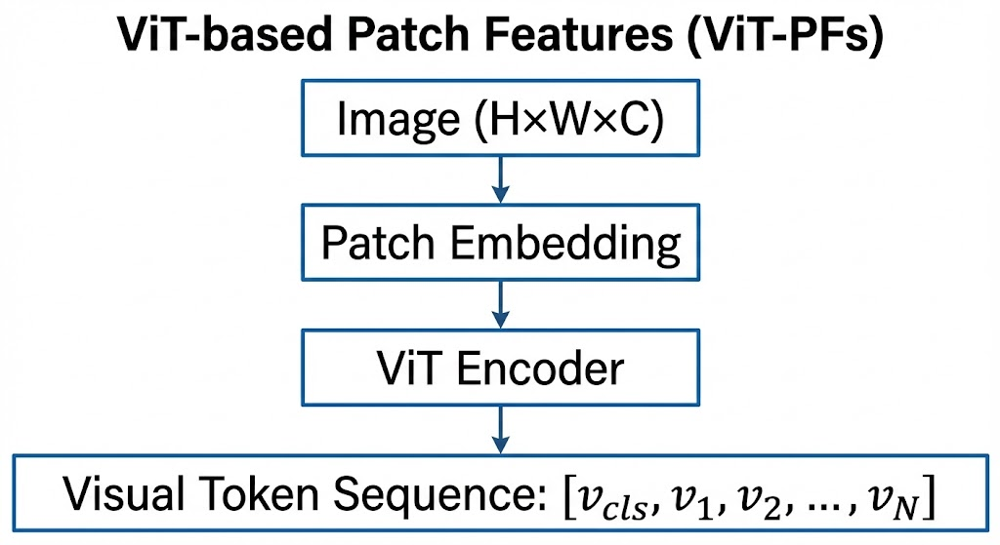
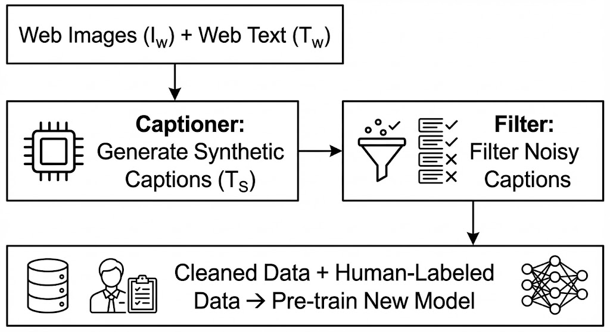

VLM（Vision-Language Model）: 视觉语言大模型

## 参考资料

# 一文了解 VLM

> 视觉语言模型（Vision-Language Model，VLM）是人工智能领域最激动人心的进展之一。它让机器能够同时"看懂"图像和"理解"语言，开启了人机交互的全新范式。本文将带你从零开始，全面了解 VLM 的原理、发展与未来。

---

## 一、什么是视觉语言模型？

### 1.1 通俗理解：给 AI 装上"眼睛"

想象一下，如果你能和一台机器这样对话：

> **你**："请描述这张图片里有什么？"  
> **AI**："图中有一只金毛犬在草地上奔跑，背景是蓝天白云，远处还有几棵树。"

或者更复杂一点：

> **你**："这张图表显示了什么趋势？"  
> **AI**："这张柱状图显示了 2020-2024 年公司营收的逐年增长趋势，其中 2023 年增长率最高，达到 35%。"

这就是视觉语言模型（VLM）的能力——**它能够同时处理视觉信息（图像、视频）和语言信息（文本），并在两者之间建立联系**。

根据 IBM 的定义，视觉语言模型是将**计算机视觉（CV）**与**自然语言处理（NLP）**功能融合到统一系统中的多模态模型。简单来说，VLM = 视觉理解 + 语言理解。

### 1.2 技术定义：多模态 AI 的集大成者

从技术角度看，VLM（也常被称为 Large Vision-Language Models，LVLMs）通常由三个核心组件构成：


**三个核心组件的作用：**

1. **视觉编码器（Visual Encoder）**：负责从图像中提取视觉特征。通常使用 Vision Transformer（ViT）架构，如 CLIP-ViT、EVA-CLIP 等。它将输入的图像转换为模型可以理解的"视觉 token"序列。

2. **视觉-语言适配器（Vision-Language Adapter）**：作为视觉和语言之间的"桥梁"，将视觉特征映射到大语言模型的嵌入空间。常见设计包括：
   - 单层线性投影（如 LLaVA）
   - 带非线性的 MLP（如 MiniGPT-4）
   - Q-Former 架构（如 BLIP-2）

3. **大语言模型（LLM）**：负责理解视觉和文本信息，并生成自然语言响应。通常使用预训练的大语言模型，如 LLaMA、Vicuna、Qwen 等。

### 1.3 VLM 与纯视觉模型、纯语言模型的区别

| 模型类型 | 输入 | 输出 | 典型任务 | 代表模型 |
|---------|------|------|---------|---------|
| **纯视觉模型** | 图像 | 类别/检测框 | 图像分类、目标检测 | ResNet、ViT、YOLO |
| **纯语言模型** | 文本 | 文本 | 文本生成、问答 | GPT、LLaMA、Qwen |
| **视觉语言模型** | 图像+文本 | 文本 | 图像描述、视觉问答、图文检索 | CLIP、BLIP、LLaVA |

VLM 的核心优势在于**跨模态理解能力**：它不仅能识别图像中的物体，还能理解物体之间的关系、场景的语义信息，并用自然语言表达出来。

---

## 二、VLM 的发展历程：从萌芽到爆发

### 2.1 早期探索（2019-2020）：双塔结构的兴起

VLM 的发展可以追溯到 2019-2020 年，这一时期的研究主要采用**双塔架构（Dual-stream Architecture）**，即分别用独立的编码器处理视觉和语言信息，然后在共享空间中对齐。

**代表性工作：**

- **ViLBERT**（2019）：将 BERT 架构扩展到视觉-语言领域，采用双流架构分别处理图像和文本
- **VisualBERT**（2020）：首个图像-文本预训练模型，使用 Faster R-CNN 提取视觉特征
- **UNITER**（2020）：大规模视觉-语言预训练，在多个下游任务上取得 SOTA

这些早期模型的共同特点是：
- 使用目标检测器（如 Faster R-CNN）提取区域特征
- 采用单流或双流 Transformer 进行跨模态融合
- 预训练任务主要包括掩码语言建模（MLM）和图像-文本匹配（ITM）

### 2.2 CLIP 时代（2021）：对比学习的革命

2021 年，OpenAI 发布了 **CLIP（Contrastive Language-Image Pre-training）**，这是 VLM 发展史上的里程碑事件。

**CLIP 的核心创新：**

1. **对比学习范式**：通过最大化匹配图文对的相似度、最小化不匹配图文对的相似度来学习跨模态表示
2. **双塔架构**：图像编码器和文本编码器独立工作，输出映射到同一语义空间
3. **大规模数据**：使用 4 亿个互联网收集的图像-文本对进行训练


CLIP 的革命性意义在于：
- **零样本能力**：无需微调即可应用于下游任务
- **开放词汇**：不受预定义类别限制，可识别任意概念
- **强大的迁移能力**：作为视觉编码器广泛应用于后续 VLM

同期，Google 发布了 **ALIGN**，采用类似的对比学习思路，但使用 18 亿个噪声更大的图文对进行训练，进一步验证了规模的重要性。

### 2.3 统一框架（2022）：理解与生成的一体化

2022 年，Salesforce 发布了 **BLIP（Bootstrapping Language-Image Pre-training）**，提出了统一的视觉-语言理解与生成框架。

**BLIP 的核心贡献：**

1. **MED（Multimodal Mixture of Encoder-Decoder）架构**：
   - 单模态编码器：分别编码图像和文本
   - 图像条件文本编码器：融合视觉信息进行理解
   - 图像条件文本解码器：生成图像描述

2. **CapFilt（Captioning and Filtering）**：
   - 使用"生成器+过滤器"策略清洗网络数据
   - 生成器（Captioner）为网络图像生成合成描述
   - 过滤器（Filter）去除噪声描述

BLIP 在图像-文本检索、图像描述、视觉问答等任务上取得了 SOTA 性能，并展示了强大的零样本迁移能力。

### 2.4 大模型时代（2023）：LLM 赋能的视觉助手

2023 年是 VLM 的爆发之年，核心趋势是**将预训练的大语言模型（LLM）与视觉能力相结合**。

**代表性模型：**

| 模型 | 机构 | 核心特点 | 发布时间 |
|-----|------|---------|---------|
| **BLIP-2** | Salesforce | 冻结视觉编码器和 LLM，使用 Q-Former 桥接 | 2023.01 |
| **LLaVA** | 威斯康星大学 | 视觉指令微调，端到端训练 | 2023.04 |
| **MiniGPT-4** | KAUST | 单投影层对齐，两阶段训练 | 2023.04 |
| **Qwen-VL** | 阿里巴巴 | 多语言、多图像、细粒度理解 | 2023.08 |

**这一时期的共同特点：**

1. **冻结预训练模型**：视觉编码器和 LLM 保持冻结，仅训练适配器，大幅降低训练成本
2. **指令微调**：使用指令数据对模型进行微调，提升指令跟随能力
3. **端到端训练**：从视觉输入直接生成文本输出，简化流程

以 **LLaVA** 为例，它首次将**视觉指令微调（Visual Instruction Tuning）**引入 VLM：
- 使用 GPT-4 生成多模态指令跟随数据
- 将 CLIP 视觉编码器与 Vicuna LLM 连接
- 端到端微调，实现强大的多模态对话能力

**BLIP-2** 则提出了两阶段训练策略：
- 第一阶段：使用冻结的视觉编码器训练 Q-Former 进行视觉-语言表示学习
- 第二阶段：将 Q-Former 连接到冻结的 LLM，进行视觉到语言的生成学习

### 2.5 最新进展（2024-2025）：多模态原生大模型

进入 2024-2025 年，VLM 朝着**更大规模、更强能力、更多模态**的方向发展。

**主要趋势：**

1. **模型规模扩大**：从 7B 参数扩展到 70B+ 参数
2. **分辨率提升**：支持更高分辨率输入（如 448×448、896×896）
3. **多模态扩展**：从图像-文本扩展到视频、音频等多模态
4. **原生多模态架构**：不再简单拼接单模态模型，而是从头设计多模态架构

以 **Qwen2-VL** 为例，它引入了：
- 原生动态分辨率支持，可处理任意分辨率的图像
- 多模态旋转位置编码（M-RoPE），统一处理图像和视频
- 强大的文档理解和 OCR 能力

---

## 三、VLM 的核心技术原理

### 3.1 模型架构：单流 vs 双流

根据 VLP 综述，VLM 的架构可以从两个维度进行分类：

#### 3.1.1 从多模态融合角度：单流 vs 双流

**单流架构（Single-stream）**：
- 将视觉特征和文本特征拼接后输入单个 Transformer
- 使用统一的自注意力机制进行融合
- 参数效率更高，但模态间干扰较大
- 代表：VisualBERT、UNITER

**双流架构（Dual-stream）**：
- 视觉和文本分别输入独立的 Transformer
- 通过交叉注意力（Cross-Attention）实现跨模态交互
- 模态内信息保留更好，但参数量更大
- 代表：CLIP、BLIP-2


#### 3.1.2 从整体设计角度：Encoder-only vs Encoder-Decoder

**Encoder-only**：
- 仅使用编码器提取跨模态表示
- 适用于理解任务（如图文检索、视觉问答）
- 代表：CLIP、ALBEF

**Encoder-Decoder**：
- 编码器提取特征，解码器生成文本
- 适用于生成任务（如图像描述）
- 代表：BLIP、OFA

### 3.2 预训练目标

VLM 的预训练目标是学习视觉和语言之间的语义对应关系。根据 VLP 综述，主要预训练目标可以分为四类：

#### 3.2.1 补全类（Completion）

**掩码语言建模（MLM）**：
- 随机掩码文本中的部分 token，让模型根据视觉信息和上下文预测
- 公式：$\mathcal{L}_{MLM} = -\mathbb{E}_{(v,w)\sim D} \log P(w_m|w_{\setminus m}, v)$
- 应用：VisualBERT、UNITER

**掩码视觉建模（MVM）**：
- 随机掩码部分图像区域，让模型根据文本和其他视觉信息预测
- 变体：掩码特征回归、掩码特征分类
- 应用：UNITER、OSCAR

#### 3.2.2 匹配类（Matching）

**图像-文本对比学习（ITC）**：
- 拉近匹配图文对的特征距离，推远不匹配图文对
- 使用 InfoNCE 损失函数
- 公式：$\mathcal{L}_{ITC} = -\frac{1}{2}\mathbb{E}_{(I,T)\sim D}[CE(y^{v2t}, p^{v2t}(I)) + CE(y^{t2v}, p^{t2v}(T))]$
- 应用：CLIP、ALBEF、BLIP

**图像-文本匹配（ITM）**：
- 二分类任务，判断图文对是否匹配
- 使用难负样本挖掘策略
- 应用：ALBEF、BLIP

#### 3.2.3 时序类（Temporal）

**帧序建模（FOM）**：
- 打乱视频帧顺序，让模型预测正确顺序
- 用于视频-语言预训练
- 应用：VideoBERT

#### 3.2.4 特定类型

**视觉问答（VQA）**：
- 将 VQA 作为预训练任务
- 分类或生成式答案预测

**视觉描述（VC）**：
- 自回归生成图像描述
- 使用语言建模损失

### 3.3 视觉特征提取的演进

VLM 中视觉特征提取方式经历了三代演进：

#### 3.3.1 第一代：基于目标检测的区域特征（OD-RFs）

- 使用预训练的目标检测器（如 Faster R-CNN）提取区域特征
- 每个区域特征为 2048 维向量，附带边界框坐标
- 优点：语义明确，包含物体级信息
- 缺点：计算开销大，只能提取有限数量的区域
- 代表：VisualBERT、UNITER、OSCAR

#### 3.3.2 第二代：基于 CNN 的网格特征（CNN-GFs）

- 使用 CNN（如 ResNet）提取网格特征
- 可以端到端训练
- 优点：计算效率更高
- 缺点：语义信息不如区域特征明确
- 代表：PixelBERT

#### 3.3.3 第三代：基于 ViT 的 Patch 特征（ViT-PFs）

- 使用 Vision Transformer 将图像分割为 patch 序列
- 每个 patch 作为一个 token
- 优点：与 NLP 的 token 形式统一，便于跨模态融合
- 代表：CLIP、BLIP、LLaVA



### 3.4 训练策略：两阶段 vs 三阶段

现代 VLM 通常采用多阶段训练策略：

#### 3.4.1 两阶段训练（以 BLIP-2 为例）

**第一阶段：视觉-语言表示学习**
- 冻结视觉编码器
- 训练 Q-Former 提取与文本最相关的视觉特征
- 使用 ITC、ITM、ITG 三个目标

**第二阶段：视觉到语言生成学习**
- 将 Q-Former 连接到冻结的 LLM
- 训练 Q-Former 使输出可被 LLM 理解
- 使用语言建模损失

#### 3.4.2 三阶段训练（以 Qwen-VL 为例）

**第一阶段：预训练**
- 冻结 LLM，训练视觉编码器和适配器
- 使用大规模图文对数据（14 亿对）
- 低分辨率输入（224×224）

**第二阶段：多任务预训练**
- 解锁 LLM，端到端训练
- 引入高质量细粒度数据（VQA、OCR、Grounding 等）
- 高分辨率输入（448×448）

**第三阶段：监督微调**
- 冻结视觉编码器，微调 LLM 和适配器
- 使用指令跟随数据
- 增强对话能力和指令理解能力

---

## 四、主流 VLM 模型详解

### 4.1 CLIP：跨模态对比学习的开创者

**基本信息**：
- 发布时间：2021 年 2 月
- 机构：OpenAI
- 参数量：约 4 亿参数（最大版本）
- 训练数据：4 亿图文对

**核心架构**：


```python
# CLIP 伪代码
image_features = image_encoder(images)  # ViT 或 ResNet
text_features = text_encoder(texts)      # Transformer

# 归一化
image_features = normalize(image_features)
text_features = normalize(text_features)

# 计算相似度
similarity = image_features @ text_features.T

# 对比损失
loss = cross_entropy_loss(similarity, labels)
```

**主要能力**：
- 零样本图像分类
- 图像-文本检索
- 作为视觉编码器用于下游任务

**局限性**：
- 仅支持理解任务，不支持生成任务
- 对细粒度视觉理解能力有限

### 4.2 BLIP/BLIP-2：统一理解与生成

#### 4.2.1 BLIP

**核心创新**：
- MED（多模态编解码混合）架构
- CapFilt 数据自举方法

**CapFilt 流程**：



#### 4.2.2 BLIP-2

**核心创新**：
- Q-Former 架构：轻量级的查询 Transformer
- 两阶段训练策略
- 可插拔的冻结模型设计

**Q-Former 架构**：


**性能表现**：
- 在 VQAv2 上超过 Flamingo-80B 8.7%，但可训练参数仅为其 1/54

### 4.3 LLaVA：视觉指令微调的先锋

**基本信息**：
- 发布时间：2023 年 4 月
- 机构：威斯康星大学麦迪逊分校
- 核心思想：将指令微调从 NLP 扩展到视觉-语言领域

**数据生成**：
- 使用 GPT-4 生成多模态指令跟随数据
- 三种类型：对话、详细描述、复杂推理
- 共 158K 样本

**架构**：


**两阶段训练**：

1. **特征对齐预训练**：
   - 冻结视觉编码器和 LLM
   - 仅训练投影矩阵
   - 使用 595K 图文对

2. **端到端微调**：
   - 冻结视觉编码器
   - 微调投影层和 LLM
   - 使用 158K 指令数据

**性能**：
- 在 Science QA 上与 GPT-4 结合达到 92.53% 准确率（SOTA）

### 4.4 MiniGPT-4：极简设计的强大能力

**基本信息**：
- 发布时间：2023 年 4 月
- 机构：阿卜杜拉国王科技大学（KAUST）

**架构**：


**核心发现**：
- 仅训练一个线性投影层即可有效对齐视觉和语言
- 训练仅需 4 张 A100 GPU，约 10 小时

**两阶段训练**：

1. **第一阶段**：使用大规模图文对（500 万对）进行预训练
2. **第二阶段**：使用 3500 个高质量详细描述进行微调

**涌现能力**：
- 详细图像描述
- 网站代码生成
- 诗歌创作
- 食谱生成
- 幽默解释

### 4.5 Qwen-VL：多语言多图像的通用模型

**基本信息**：
- 发布时间：2023 年 8 月
- 机构：阿里巴巴
- 基础模型：Qwen-7B

**核心特点**：

1. **多语言支持**：
   - 支持中英文双语
   - 训练数据中 77.3% 英文，22.7% 中文

2. **多图像输入**：
   - 支持任意交错的图文数据
   - 可比较、理解多张图像

3. **细粒度理解**：
   - 高分辨率输入（448×448）
   - 支持文本阅读（OCR）
   - 支持视觉定位（Grounding）

**三阶段训练**：

| 阶段 | 数据 | 训练策略 | 分辨率 |
|-----|------|---------|--------|
| 预训练 | 14 亿图文对 | 冻结 LLM，训练视觉模块 | 224×224 |
| 多任务预训练 | 7 个任务（76.8M 样本） | 端到端训练 | 448×448 |
| 监督微调 | 350K 指令数据 | 冻结视觉，微调 LLM | 448×448 |

**性能表现**：
- Flickr30K 图像描述：85.8 CIDEr（零样本 SOTA）
- VQAv2：79.5% 准确率
- RefCOCO 定位：88.55% 准确率

---

## 五、VLM 的应用场景

### 5.1 图像描述与视觉问答

**图像描述（Image Captioning）**：
- 为图像生成自然语言描述
- 应用：辅助视障人士、图像检索、内容审核

**视觉问答（Visual Question Answering, VQA）**：
- 根据图像内容回答自然语言问题
- 应用：智能客服、教育辅助、医疗影像分析

### 5.2 图文检索

**图像-文本检索**：
- 文本到图像检索：根据文本描述找到匹配图像
- 图像到文本检索：根据图像找到相关文本描述
- 应用：搜索引擎、电商平台、内容推荐

### 5.3 文档理解

**OCR 与文档分析**：
- 文本阅读：识别图像中的文字内容
- 表格理解：解析表格结构和内容
- 图表分析：理解图表中的数据和趋势
- 应用：金融报告分析、合同审查、发票处理

### 5.4 视觉定位与指代表达

**视觉定位（Visual Grounding）**：
- 根据文本描述定位图像中的物体
- 输出边界框坐标

**指代表达理解（Referring Expression Comprehension）**：
- 理解如"左边的红衣服女孩"这样的描述
- 应用：机器人导航、图像编辑、交互式 AI

### 5.5 创意生成

**图像到代码**：
- 将手绘草图转换为 HTML/CSS 代码
- 应用：前端开发、原型设计

**图像到故事/诗歌**：
- 根据图像创作故事或诗歌
- 应用：内容创作、教育娱乐

---

## 六、幻觉问题：VLM 的阿喀琉斯之踵

### 6.1 什么是 VLM 幻觉？

根据《视觉语言大模型的幻觉综述》，**VLM 幻觉是指模型生成的文本响应表现出对图像内容的错误感知**。

**幻觉示例**：

| 图像内容 | 模型输出 | 问题 |
|---------|---------|------|
| 只有酸奶和草莓的冰箱 | "有草莓味酸奶" | 物体存在幻觉 |
| 限速 40km/h 的路牌 | "限速 60km/h" | 属性幻觉 |
| 猫在沙发上 | "沙发上有一只狗" | 物体识别错误 |

### 6.2 幻觉的分类

根据幻觉综述，VLM 幻觉可分为三类：

1. **物体存在幻觉（Object Existence Hallucination）**：
   - 描述图像中不存在的物体
   - 遗漏图像中存在的物体

2. **物体属性幻觉（Object Attribute Hallucination）**：
   - 错误描述物体的颜色、形状、材质等属性

3. **物体关系幻觉（Object Relationship Hallucination）**：
   - 错误描述物体之间的空间位置关系
   - 错误描述物体之间的交互关系

此外，研究还定义了其他类型的幻觉：
- **多模态冲突幻觉**：文本输入与视觉输入不匹配时引发的幻觉
- **反常识幻觉**：图像中存在反常识元素时导致的幻觉
- **事件幻觉**：基于错误感知创造出完全虚构的事件或情景
- **数字幻觉**：未能准确识别图像中特定物体的数量

### 6.3 幻觉的成因

幻觉综述从四个维度分析了幻觉的成因：

#### 6.3.1 训练数据相关

1. **图像的文本描述不够细致**：
   - 开源数据集中的文本描述较为粗糙
   - 无法充分覆盖图像内容

2. **合成的指令微调数据存在噪声**：
   - 使用 GPT-4 生成的指令数据可能包含幻觉元素
   - 研究显示 LLaVA 的 GPT-4 合成数据中约 32.6% 含有幻觉

3. **数据中存在统计偏差**：
   - 物体类别出现频率不均衡
   - 正向响应比例过高

#### 6.3.2 训练任务相关

- 单一的语言建模任务缺乏对模态间一致性的显式约束
- 模型过于关注生成文本的流畅性，而忽略与视觉信息的一致性

#### 6.3.3 视觉编码相关

1. **细粒度视觉信息感知能力不足**：
   - 输入分辨率通常低于 400 像素
   - 训练数据中的文本标注只能涵盖主要内容而非细节

2. **视觉特征无法受到 LLM 的充分关注**：
   - 视觉 token 在 LLM 中的平均注意力分数不足 20%
   - 随着生成进行，对视觉 token 的关注持续下降

#### 6.3.4 文本生成相关

1. **LLM 的先验性知识偏差**：
   - 模型倾向于依赖先验知识而非实际视觉证据
   - 即使输入噪声图像，仍可能输出高置信度答案

2. **自回归解码中的偏差累积**：
   - 早期生成的小错误会在后续生成中被放大
   - 幻觉频率随生成长度增加而升高

3. **固有的采样随机性**：
   - 采样过程可能导致模型偶尔输出概率较低的错误 token

### 6.4 幻觉的评估

幻觉评估基准包括：

| 基准 | 任务形式 | 评估指标 | 幻觉类型 |
|-----|---------|---------|---------|
| CHAIR | 图像描述 | CHAIRi, CHAIRs | 物体存在 |
| POPE | 视觉问答 | 准确率、F1 | 物体存在 |
| MME | 视觉问答 | Accuracy+ | 存在、属性 |
| AMBER | 描述+问答 | 准确率、精确率、召回率 | 存在、属性、关系 |
| MMHAL-BENCH | 描述+问答 | GPT-4 评分 | 多种类型 |

### 6.5 幻觉的治理

幻觉综述从五个维度讨论了幻觉治理策略：

#### 6.5.1 数据侧

- 提升指令数据的多样性
- 增强图像-文本关联度
- 使用高质量的人工标注数据

#### 6.5.2 视觉感知侧

- 使用更高分辨率的视觉编码器
- 集成多个视觉编码器
- 增加视觉编码器的参数规模

#### 6.5.3 训练策略侧

- 引入新的监督信号
- 使用强化学习
- 增加任务信息

#### 6.5.4 推理侧

- 对比解码
- 不确定性估计
- 多步推理

#### 6.5.5 事后修正侧

- 使用外部知识验证
- 自我修正机制
- 人类反馈

---

## 七、VLM 的技术挑战与未来方向

### 7.1 当前挑战

#### 7.1.1 幻觉问题
- 如前所述，幻觉是限制 VLM 在高风险领域应用的主要因素
- 需要更可靠的评估和治理方法

#### 7.1.2 细粒度理解
- 当前 VLM 对细节的理解能力仍有限
- 高分辨率处理需要更多计算资源

#### 7.1.3 多模态融合
- 如何更好地融合视觉、语言、音频等多种模态
- 如何处理模态间的信息冲突

#### 7.1.4 计算效率
- 大规模 VLM 的推理成本高昂
- 需要更高效的模型压缩和加速技术

### 7.2 未来方向

#### 7.2.1 原生多模态架构
- 从头设计支持多模态的架构，而非简单拼接单模态模型
- 统一处理文本、图像、视频、音频等多种模态

#### 7.2.2 世界模型
- 构建能够理解物理世界的 VLM
- 支持因果推理和物理模拟

#### 7.2.3 具身智能
- 将 VLM 与机器人结合
- 支持视觉导航、物体操作等任务

#### 7.2.4 个性化与可解释性
- 支持用户个性化的 VLM
- 提供可解释的推理过程

---

## 八、总结

视觉语言模型（VLM）代表了人工智能领域的重要进展，它让机器能够同时"看懂"图像和"理解"语言，开启了人机交互的全新范式。

**从发展历程看**：
- 从早期的双塔架构到 CLIP 的对比学习革命
- 从 BLIP 的统一框架到 LLM 赋能的视觉助手
- VLM 正在朝着更大规模、更强能力、更多模态的方向发展

**从技术原理看**：
- VLM 的核心在于跨模态对齐和融合
- 预训练目标、模型架构、训练策略都在不断演进
- 幻觉问题仍是当前的主要挑战

**从应用场景看**：
- 图像描述、视觉问答、图文检索等基础任务已较为成熟
- 文档理解、视觉定位、创意生成等高级任务正在快速发展
- 未来将在更多领域发挥重要作用

对于初学者，理解 VLM 的关键在于把握**跨模态对齐**这一核心思想；对于技术从业者，则需要深入理解各种架构设计和训练策略的优劣。无论如何，VLM 都是一个值得持续关注的领域，它正在重新定义人机交互的方式，让我们离真正的通用人工智能更近一步。

---

## 参考资料

[1]: [什么是视觉语言模型 (VLM)？| IBM](https://www.ibm.com/cn-zh/think/topics/vision-language-models)

[2]: [VLM 说明](https://github.com/IBM/vlm)

[3]: [VLP: A Survey on Vision-Language Pre-training](https://ar5iv.labs.arxiv.org/html/2202.09061)

[4]: [Learning Transferable Visual Models From Natural Language Supervision (CLIP)](https://arxiv.org/abs/2103.00020)

[5]: [Scaling Up Visual and Vision-Language Representation Learning With Noisy Text Supervision (ALIGN)](https://arxiv.org/abs/2102.05918)

[6]: [BLIP: Bootstrapping Language-Image Pre-training for Unified Vision-Language Understanding and Generation](https://arxiv.org/abs/2201.12086)

[7]: [Visual Instruction Tuning (LLaVA)](https://arxiv.org/abs/2304.08485)

[8]: [BLIP-2: Bootstrapping Language-Image Pre-training with Frozen Image Encoders and Large Language Models](https://arxiv.org/abs/2301.12597)

[9]: [Qwen2-VL: Enhancing Vision-Language Model's Perception of the World at Any Resolution](https://arxiv.org/abs/2409.12191)

[10]: [视觉语言大模型的幻觉综述：成因、评估与治理](https://crad.ict.ac.cn/article/doi/10.7544/issn1000-1239.202440444)

---

**延伸阅读**：
- [Guide to Vision-Language Models (VLMs) | Encord](https://encord.com/blog/vision-language-models-guide/)
- [视觉语言模型详解 | Hugging Face](https://huggingface.co/blog/zh/vlms)
- [What Are Vision Language Models | NVIDIA](https://www.nvidia.com/en-us/glossary/vision-language-models/)

