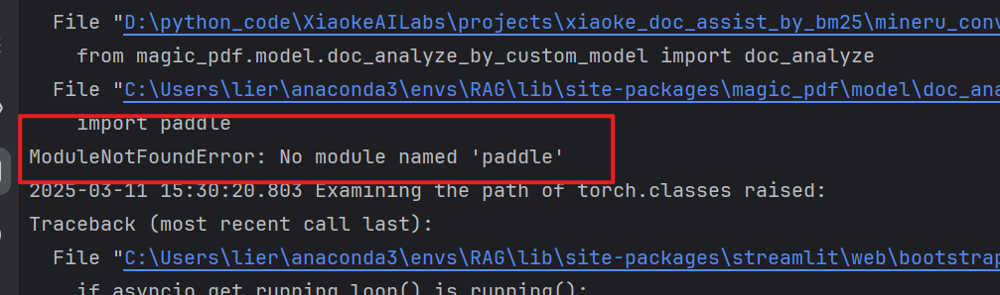
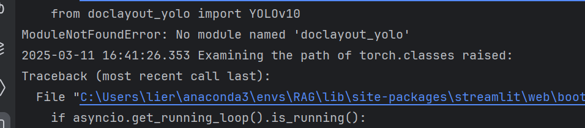
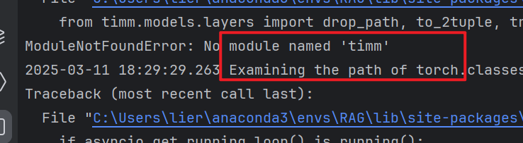
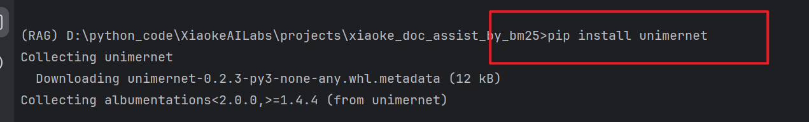
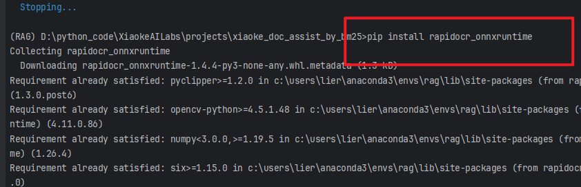

# 基于BM25检索算法构建RAG智能文档问答助手

> 本篇文章记录DataWhale微学习中课程--从零打造RAG检索系统

> 推一波DataWhale的学习内容，可以关注DataWhale公众号，选择自己喜欢的内容

> 学习内容原作者的公众号: [从零打造RAG检索系统：BM25让检索快到飞起](https://mp.weixin.qq.com/s/J2IzIF5-tvtU5IQgd6F6Sw) github仓库地址: [XiaokeAILabs](https://github.com/li-xiu-qi/XiaokeAILabs)

> 文章重点是了解RAG检索的基础，运行作者代码测试工具效果

## 1、RAG及相关基础概念

### 1.1、什么是RAG
RAG（Retrieval-Augmented Generation，检索增强生成）是一种结合检索和自然语言生成的技术，旨在提高生成模型的性能和效果。RAG的基本思想是在生成模型的输入中同时包含检索到的相关信息，从而提高生成模型的生成质量和准确性。

想起之前使用过Langchain结合ChatGLM3-6B模型，实现过一个智能漏洞问答系统，用的应该就是RAG，不过当时对这些概念并不了解。

在日常使用中的kimi、豆包和加入联网功能的DeepSeek，应该都应用到了这种技术，不过他们的实现原理和算法应该更加复杂，实现细节上可能也有不同。

### 1.2、RAG的基本流程

RAG的基本流程还是比较简单的，可以分成两个阶段：

1. 索引阶段:预处理并存储文档数据，构建检索索引
2. 查询阶段:接收用户查询，检索相关文档，将文档信息作为生成模型的输入，生成相应的回答

### 1.3、RAG系统核心组件

想要实现一个完整的RAG过程需要上传并处理额外的文档和数据，这些数据可以是文本、图像、音频、视频等。然后要对这些数据进行处理，比如对文本进行分词、去除停用词、向量化……

之后要构建检索索引，这一步可以使用多种算法，比如BM25、TF-IDF、向量检索等。

最后就是生成模型，根据用户输入的信息，检索额外数据，将检索到的信息与用户查询结合，通过LLM生成最终答案。

核心部分可以分成
1. 数据处理
2. 检索索引
3. 生成模型

当然这是我自己的概括，不准确

### 1.4、BM25算法

BM25（Best Matching 25）是一种经典的信息检索算法，是基于Okapi TF-IDF算法的改进版本，旨在解决Okapi TF-IDF算法的一些不足之处。它被广泛应用于信息检索领域的排名函数，用于估计文档D与用户查询Q之间的相关性。BM25是一种基于概率检索框架的改进，特别是在处理长文档和短查询时表现出色。它旨在评估一组查询项与文档的相关性，并为每个文档计算一个分数，该分数决定了文档在搜索结果中的排名。BM25的核心思想是基于词频（TF）和逆文档频率（IDF），同时还引入了文档的长度信息来计算文档D和查询Q之间的相关性。目前被广泛运用的搜索引擎ES就内置了BM25算法进行全文检索。

具体计算公式就不详细介绍了。

除了BM25，还有很多其他的检索算法，比如TF-IDF、向量检索、语义检索等。

## 2、基于BM25的RAG检索系统运行

### 2.1、环境配置

环境配置的过程一波三折，可能用linux环境运行更好？

Python版本: 3.10+

环境管理工具: conda

打开cmd，使用下面的命令直接创建环境

```bash
conda create --name RAG python=3.10
```

### 2.2、git项目到本地

原作者的github仓库地址[XiaokeAILabs](https://github.com/li-xiu-qi/XiaokeAILabs)

可以使用下面的指令直接git到本地

```bash
git clone https://github.com/li-xiu-qi/XiaokeAILabs.git
```

### 2.3、安装依赖

先进入项目中的**xiaoke_doc_assist_by_bm25**文件夹，然后在该目录下进入cmd

首先使用下面的指令安装依赖

```bash
pip install -r requirements.txt
```
安装完成后在当前目录下创建 **.env** 文件，文件内容可以复制 **.env.example** 中的

这里要配置调用模型的API，我之前在硅基流动免费领过额度，所以跟作者一样使用硅基流动的API和密钥

如果使用硅基流动，直接修改 **API_KEY=your_api_key**


也可以使用其他平台的API，比如 OpenAI、火山等，要修改 **API_KEY** 和 **BASE_URL**

配置好后还要下载MinerU模型，用于高质量PDF解析

在当前目录下使用下面指令，如果开了IDE也可以直接运行python文件

```bash
python download_mineru_models.py
```


### 2.4、运行项目

在当前目录下使用下面指令运行项目

```bash
streamlit run main.py
```

> 当然，这只是开始，我们仍旧有很多潜在的依赖没有安装，由于不知道安装啥，只能一遍遍运行启动项目的指令，根据报错信息安装，直到最后项目成功启动。

总的来说，缺啥补啥，最后会运行成功的。

下面是我的辛路历程

1、缺少magic-pdf


检查后这里需要升级magic-pdf

使用指令
```bash
pip install --upgrade magic-pdf
```


2、缺少paddle


安装paddle

```bash
pip install paddle
```

但是还会报错，缺少paddle的依赖


安装依赖
```bash
pip install common dual tight data prox
```

安装之后发现还是报错


搜索发现paddle太老了，应该升级安装paddlepaddle

安装指令
```bash
pip install --upgrade paddlepaddle
```

3、缺少cv2


安装依赖

```bash
pip install opencv-python
```


4、缺少ultralytics


安装依赖

```bash
pip install ultralytics
```


5、缺少doclayout_yolo



安装依赖

```bash
pip install doclayout_yolo
```


6、缺少pycocotools


安装依赖

```bash
pip install pycocotools
```


7、缺少detectron2


安装依赖

这个依赖的安装可以参考博客[Windows11安装detectron2全流程记录帖（含torch安装）](https://blog.csdn.net/weixin_43907922/article/details/138082343)

这个过程中可能会报错，缺少ninja

使用下面指令安装

```bash
pip install ninja
```

还会报错要安装Microsoft C++ Build Tools，可能是缺少C++编译器？

如果有这个报错点击连接，安装就行，在安装的时候一定要勾选C++桌面开的部分

解决上面两个问题后安装应该不会有问题

8、缺少timm



安装依赖

```bash
pip install timm
```


9、缺少unimernet


安装依赖

```bash
pip install unimernet
```


10、缺少paddleocr


安装依赖

```bash
pip install paddleocr
```


11、缺少rapid_table


安装依赖

```bash
pip install rapid_table
```

12、缺少struct_eqtable


安装依赖

```bash
pip install struct_eqtable
```


13、缺少Stemmer


安装依赖

```bash
pip install PyStemmer
```


> 现在应该能正常运行项目了？

在运行起来之后，我尝试上传文件，还有一个报错安装依赖


安装依赖

```bash
pip install rapidocr_onnxruntime
```


> 现在确实可以运行了

## 3、项目效果

在运行完成后，我上传了自己桌面上的一个论文，经过测试可以成功解析，但是不能够检索内容并喂给大模型，还没找到原因。

之后我用作者提供的测试论文，发现可以成功运行。

贴一张图：


## 4、总结

这是一个非常简单（可能也没那么简单），但是非常有意思的RAG检索系统，但是可以作为一个学习的起点，了解RAG检索的基本流程和原理。

在实际应用中，RAG检索系统的实现可能会更加复杂，需要考虑更多的因素，比如数据处理、检索索引、生成模型等。

现在运行项目还会有很多问题，后续我也会发现原因，或许实践构建一个自己的RAG检索系统？

