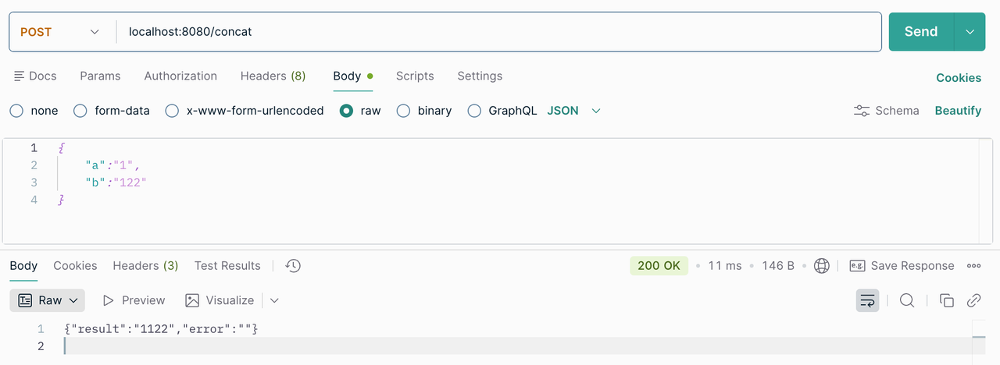
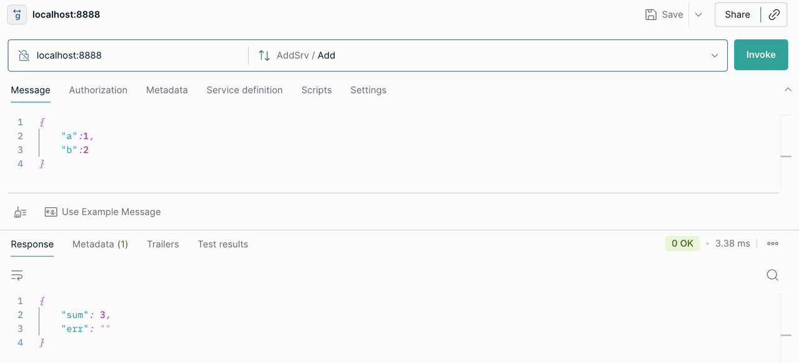

相关代码的GitHub地址：[GoKitAddSrv](https://github.com/aorangehc/GoFramwork/tree/main/GoKitAddSrv)，不同文件夹代表不同章节，直接**go run .**&#x53EF;运行

<span style="color: rgb(216,57,49); background-color: rgba(255,246,122,0.8)">写得比较简单，能跑就行，一些bug和规范问题见谅！</span>

## 简介

go-kit严格意义上并不算是一个完整的框架，更像是一个工具箱或者库的集合，官方描述它为一组包和最佳实践的集合。


它提供了构建微服务所有的标准组件，并且采用整洁架构和洋葱结构。它不追求开发的速度，而是采用强制三层架构，严格分成业务逻辑层（Service）、作为适配器的端点层（Endpoint）和进行协议处理的传输层（Transport），将业务逻辑和网络通信完全解耦。

## 核心结构-三层模型


### Transport

这是最外层的结构，负责处理具体的网络协议，通常是http和rpc，主要功能就是进行编解码，将外部传来的请求，比如Json解析成Endpoint能够读懂的golang结构体，然后调用Endpoint层，再将从Endpoint层获取的结果进行编码，传输发送给客户端。

### Endpoint

这是连接业务和网络的中间一层，它负责将Service层中的各种方法强制封装成一个统一的标准函数签名，然后交给Transport层调用

```go
// Endpoint定义
type Endpoint func(ctx context.Context, request interface{}) (response interface{}, err error)
```

在这一层，所有的调用都会被统一抽象成同一种形式，通常在这一层进行中间件的挂载。实现一套中间件能应用于所有的接口。

### Service

业务逻辑层Service只考虑具体业务逻辑的实现，定义并实现接口即可，不用考虑协议和网络服务。

## Demo-实现一个简单加法器

### HTTP

#### 说明

1. 在Service层定义接口，包含两个方法

   1. Add实现int类型的的加法

   2. Concat实现string类型的加法

   3. 基本流程就是定义接口，实现接口

2. 在Endpoint层，定义请求和响应数据的结构体，将Service层的方法进行封装

   1. 接本流程就是定义结构体，封装方法

3. 在Transport层，进行具体协议处理和响应

   1. 实现编解码

   2. 实现Handler

   3. 定义路由和端口

   4. ……

#### 测试

使用Postman进行测试




### RPC

这里使用gRpc

#### 说明

1. 实现proto文件

   1. 定义proto文件夹

   2. 在文件夹中编写proto文件，定义service和message

   3. 执行protoc指令，生成golang文件

      ```go
      protoc -I=proto --go_out=proto --go_opt=paths=source_relative --go-grpc_out=proto --go-grpc_opt=paths=source_relative proto/addsrv.proto
      ```

2. 在Service层定义接口，包含两个方法

   1. Add实现int类型的的加法

   2. Concat实现string类型的加法

   3. 基本流程就是定义接口，实现接口

3. 在Endpoint层，定义请求和响应数据的结构体，将Service层的方法进行封装

   1. 接本流程就是定义结构体，封装方法

4. 在Transport层，进行具体协议处理和响应

   1. 实现rpc编解码

   2. 实现Handler

   3. 实现protobuf接口

   4. ……

#### 测试

使用Postman进行测试




## 项目结构拆分

根据go-kit设计好的三层结构，我们对原本单独的三个文件夹进行分层实现，下面是具体的目录结构


## 中间件

### 日志

1. 全局创建日志

2. 在接口实现的时候传入日志

3. 定义日志接口，在接口中加入应用接口+日志，然后再实现方法

```go
// go-kit官方设计
type logMiddleware struct {
    logger log.Logger
    next   AddService
}
```

在项目中加入日志中间件，简单实现示意


### 限流

加入限流中间件，1秒钟只能请求一次

在实际业务场景中可以针对单个用户进行更加细粒度的限制


在项目中加入限流中间件，简单实现示意


### 指标采集

使用metrics包来记录关于服务运行时行为的统计信息，比如计算已处理作业的数量、记录请求完成后的持续时间以及跟踪正在执行的操作的数量等等。

在项目中加入指标采集中间件，简单实现示意


## 服务调用

通过构建结构体，加入当前服务和被调用服务（被设置为endpoint.Endpoint类型）实现调用


简单实现示意


## 服务发现和负载均衡

<span style="color: rgb(143,149,158); background-color: rgba(255,246,122,0.8)">关于concul的安装和使用可以见：</span>[<span style="color: rgb(143,149,158); background-color: rgba(255,246,122,0.8)">concul</span>](http://localhost:8080)

go-kit提供服务发现和负载均衡的相应机制

* Go kit 提供了工厂函数Factory， 它是一个将实例字符串(例如host:port)转换为特定端点的函数。提供多个端点的实例需要多个工厂函数。工厂函数还返回一个当实例消失并需要清理时调用的io.Closer。

* Go kit 提供了基本的负载均衡器，也可以自己实现。

* 重试策略包装负载均衡器，并返回可用的端点。重试策略将重试失败的请求，直到达到最大尝试或超时为止。

```go
// 工厂函数
type Factory func(instance string) (endpoint.Endpoint, io.Closer, error)

//  负载均衡
import "github.com/go-kit/kit/sd/lb"
balancer := lb.NewRoundRobin(endpointer)

// 重试
func Retry(max int, timeout time.Duration, lb Balancer) endpoint.Endpoint
import "github.com/go-kit/kit/sd/lb"
retry := lb.Retry(3, 500*time.Millisecond, balancer)
```

下面是简单实现

开了两个trim\_service分别在两个终端，调用的时候会自动轮询


## 参考资料

[Go-kit](https://github.com/go-kit/kit/tree/master?tab=readme-ov-file)

[Gemini老师](https://gemini.google.com/)

[Go kit教程01——基础示例](https://www.liwenzhou.com/posts/Go/go-kit-tutorial-01/)

[Go kit教程02——gRPC](https://www.liwenzhou.com/posts/Go/go-kit-tutorial-02/)

[Go kit教程03——代码分层](https://www.liwenzhou.com/posts/Go/go-kit-tutorial-03/)

[Go kit教程04——中间件和日志](https://www.liwenzhou.com/posts/Go/go-kit-tutorial-04/)

[Go kit教程05——调用其他服务](https://www.liwenzhou.com/posts/Go/go-kit-tutorial-05/)

[Go kit教程06——服务发现和负载均衡](https://www.liwenzhou.com/posts/Go/go-kit-tutorial-06/)


