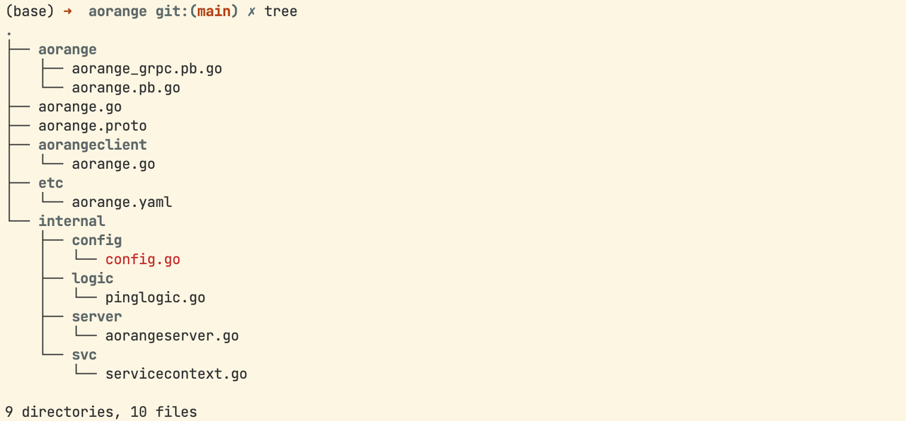
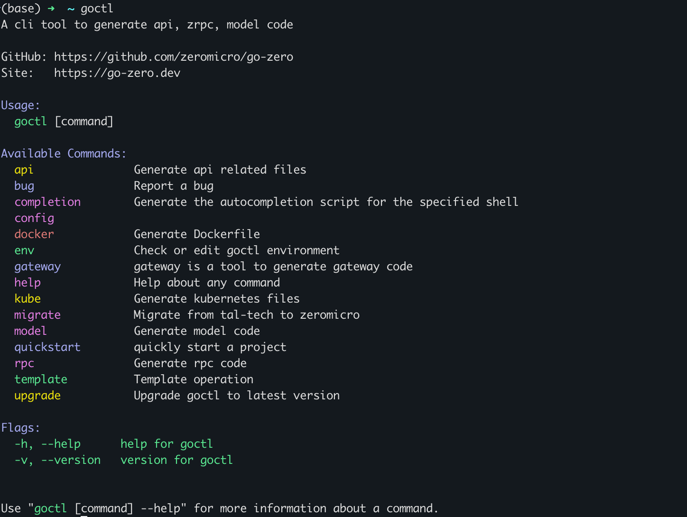

## 简介

go-zero是一个集成了各种工程实践的 web 和 rpc 框架。通过弹性设计保障了大并发服务端的稳定性，经受了充分的实战检验。

go-zero 包含极简的 API 定义和生成工具 goctl，可以根据定义的 api 文件一键生成 Go, iOS, Android, Kotlin, Dart, TypeScript, JavaScript 代码，并可直接运行。

go-zero框架能轻松获得支撑千万日活服务的稳定性，内建级联超时控制、限流、自适应熔断、自适应降载等微服务治理能力，无需配置和额外代码，微服务治理中间件可无缝集成到其它现有框架使用，极简的 API 描述，一键生成各端代码，自动校验客户端请求参数合法性，大量微服务治理和并发工具包。

go-zero框架具有强大的工具支持，尽可能少的代码编写，极简的接口，完全兼容 net/http，支持中间件，方便扩展，高性能，面向故障编程，弹性设计，内建服务发现、负载均衡，内建限流、熔断、降载，且自动触发，自动恢复，API 参数自动校验，超时级联控制，自动缓存控制，链路跟踪、统计报警等，高并发支撑，稳定保障了疫情期间每天的流量洪峰。

下面是官方给的架构图


## 安装和快速使用

### 安装

这里主要是go-zero、goctl和go-zero的安装指令，可以参照官方的文档：[快速开始](https://go-zero.dev/docs/tasks)

注意先安装go，关于go的安装和配置可以见博客：[g的安装和使用](https://aorangehc.github.io/content/learning-notes/golang/entries/go%E7%9A%84%E7%89%88%E6%9C%AC%E7%AE%A1%E7%90%86%E5%B7%A5%E5%85%B7-g%E7%9A%84%E5%AE%89%E8%A3%85%E5%92%8C%E4%BD%BF%E7%94%A8.html)

```bash
# go-zero安装
go get -u github.com/zeromicro/go-zero@latest
# goctl安装
go install github.com/zeromicro/go-zero/tools/goctl@latest
# protoc安装
goctl env check --install --verbose --force
```


### 快速使用

#### Api demo

在这里我创建了一个文件夹GoZeroDemo存放go-zero微服务框架学习期间的相关代码，之后初始化项目，并使用gpctl自动生成简单API相关文件

```bash
# 创建并进入项目
mkdir GoZeroDemo && cd GoZeroDemo
# 初始化项目并命名
go mod init gozerodemo
# 使用goctl创建API服务
goctl api new greet
# 安装缺失的依赖
go mod tidy
```

下面是生成的代码框架，包括配置文件、main文件、配置定义文件、网络路由相关文件、请求逻辑文件、业务逻辑相关文件以及业务相关结构体文件等等。


之后我们根据官方说明，在greetlogic.go中实现Greet，做简单的 Say Hello，测试效果如下，一个简单的单体服务就构建完成了。


通过简单的使用go-zero我们可以发现，框架的作用就是帮你生成配套代码，你只需要完成相应的业务逻辑。

#### gRPC demo

继续在GoZeroDemo目录下创建gRPC服务aorange

```bash
# 使用goctl创建RPC服务
goctl rpc new aorange
# 安装缺失的依赖
go mod tidy
```




之后按照文档进行简单修改测试：[gRPC-demo](https://go-zero.dev/docs/tasks/cli/grpc-demo)


#### MySQL

创建sql文件，之后通过goctl生成对应的golang文件和操作方法，具体参考：[mysql代码生成](https://go-zero.dev/docs/tasks/cli/mysql)

```bash
goctl model mysql ddl --src user.sql --dir .
```


#### Mongo

mongo 不像 mysql 一样有建表语句，索引等集中有规律的约束信息，因此 mongo 代码的生成无需类似 sql 或者数据库链接一样的信息。，具体参考：[mongo代码生成](https://go-zero.dev/docs/tasks/cli/mongo)

```bash
goctl model mongo --type user --dir .
```


#### format

还可以通过goctl进行格式化，具体见：[api文件格式化](https://go-zero.dev/docs/tasks/cli/api-format)

```bash
goctl api format --dir demo.api
```

## Goctl

下面是goctl相关的指令和说明，我们常用的就是api和rpc



### Api


参考官方给的api示例，我们使用goctl通过api文件创建服务

首先创建项目文件夹添加user.api

之后在终端输入指令

```bash
goctl api go -api user.api -dir . -style goZero
```

```protobuf
syntax = "v1"

type (
        // 定义登录接口的 json 请求体
        LoginReq {
                Username string `json:"username"`
                Password string `json:"password"`
        }
        // 定义登录接口的 json 响应体
        LoginResp {
                Id       int64  `json:"id"`
                Name     string `json:"name"`
                Token    string `json:"token"`
                ExpireAt string `json:"expireAt"`
        }
)

type (
        // 定义获取用户信息的 json 请求体
        GetUserInfoReq {
                Id int64 `json:"id"`
        }
        // 定义获取用户信息的 json 响应体
        GetUserInfoResp {
                Id   int64  `json:"id"`
                Name string `json:"name"`
                Desc string `json:"desc"`
        }
        // 定义更新用户信息的 json 请求体
        UpdateUserInfoReq {
                Id   int64  `json:"id"`
                Name string `json:"name"`
                Desc string `json:"desc"`
        }
)

// 定义 HTTP 服务
// @server 语法块主要用于控制对 HTTP 服务生成时 meta 信息，目前支持功能有：
// 1. 路由分组
// 2. 中间件声明
// 3. 路由前缀
// 4. 超时配置
// 5. jwt 鉴权开关
// 所有声明仅对当前 service 中的路由有效
@server (
        // 代表当前 service 代码块下的路由生成代码时都会被放到 login 目录下
        group: login
        // 定义路由前缀为 "/v1"
        prefix: /v1
)
// 微服务名称为 user，生成的代码目录和配置文件将和 user 值相关
service user {
        // 定义 http.HandleFunc 转换的 go 文件名称及方法，每个接口都会跟一个 handler
        @handler login
        // 定义接口
        // 请求方法为 post
        // 路由为 /user/login
        // 请求体为 LoginReq
        // 响应体为 LoginResp，响应体必须有 returns 关键字修饰
        post /user/login (LoginReq) returns (LoginResp)
}

// @server 语法块主要用于控制对 HTTP 服务生成时 meta 信息，目前支持功能有：
// 1. 路由分组
// 2. 中间件声明
// 3. 路由前缀
// 4. 超时配置
// 5. jwt 鉴权开关
// 所有声明仅对当前 service 中的路由有效
@server (
        // 代表当前 service 代码块下的所有路由均需要 jwt 鉴权
        // goctl 生成代码时会将当前 service 代码块下的接口
        // 信息添加上 jwt 相关代码，Auth 值为 jwt 密钥，过期
        // 等信息配置的 golang 结构体名称
        jwt: Auth
        // 代表当前 service 代码块下的路由生成代码时都会被放到 user 目录下
        group: user
        // 定义路由前缀为 "/v1"
        prefix: /v1
)
// 注意，定义多个 service 代码块时，服务名称必须一致，因此这里的服务名称必须
// 和上文的 service 名称一样，为 user 服务。
service user {
        // 定义 http.HandleFunc 转换的 go 文件名称及方法，每个接口都会跟一个 handler
        @handler getUserInfo
        // 定义接口
        // 请求方法为 post
        // 路由为 /user/info
        // 请求体为 GetUserInfoReq
        // 响应体为 GetUserInfoResp，响应体必须有 returns 关键字修饰
        post /user/info (GetUserInfoReq) returns (GetUserInfoResp)

        // 定义 http.HandleFunc 转换的 go 文件名称及方法，每个接口都会跟一个 handler
        @handler updateUserInfo
        // 定义接口
        // 请求方法为 post
        // 路由为 /user/info/update
        // 请求体为 UpdateUserInfoReq
        // 由于不需要响应体，因此可以忽略不写
        post /user/info/update (UpdateUserInfoReq)
}
```


### RPC


rpc采用同样的方式

相关指令和代码如下：

```bash
goctl rpc protoc user.proto --go_out=. --go-grpc_out=. --zrpc_out=.
```

```protobuf
// 声明 proto 语法版本，固定值
syntax = "proto3";

// proto 包名
package greet;

// 生成 golang 代码后的包名
option go_package = "example/proto/greet";

// 定义枚举

enum Status{
  UNSPECIFIED = 0;
  SUCCESS = 1;
  FAILED = 2;
}

// 定义结构体

message Base{
  int32 code = 1;
  string msg = 2;
}

message SendMessageReq{
  string message = 1;
}

message SendMessage{
  // 使用枚举
  Status status = 1;
  // 数组
  repeated string array = 2;
  // map
  map<string,int32> map = 3;
  // 布尔类型
  bool boolean = 4;
  // 序列号保留
  reserved 5;
}

message SendMessageResp{
  Base base = 1;
  SendMessage data = 2;
}

// 定义 Greet 服务
service Greet {
  // 定义客户端流式 rpc
  rpc SendMessage(stream SendMessageReq) returns (SendMessageResp);
}
```


### Model


以SQL为例，创建sql文件，通过下面指令生成相关代码

```bash
goctl model mysql ddl -src"./user.sql" -dir="./sql/model" -c
```


## 参考资料

[go-zero](https://github.com/zeromicro/go-zero/tree/master)

[go-zero官方文档](https://go-zero.dev/)

[go的版本管理工具-g的安装和使用](https://aorangehc.github.io/content/learning-notes/golang/entries/go%E7%9A%84%E7%89%88%E6%9C%AC%E7%AE%A1%E7%90%86%E5%B7%A5%E5%85%B7-g%E7%9A%84%E5%AE%89%E8%A3%85%E5%92%8C%E4%BD%BF%E7%94%A8.html)
